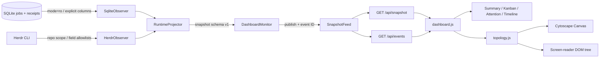

# 本地 Dashboard
Active contributors: oldwinter, chendongdong

## Purpose

Dashboard 是 coordinator 之外的 **loopback-only、只读实时投影**。它把 SQLite durable queue 中的 job/receipt 与 Herdr 中和当前仓库相关的 workspace、Git worktree、tab、pane、agent lifecycle 关联到同一份 snapshot，再通过本地 HTTP + SSE 展示。

它不 claim job、不续租、不 retry/resume、不 focus pane，也不读取 prompt 或 terminal output。因此 Dashboard 不是第二个 coordinator；页面中的 attention、drift、`working`、`agent_settled` 都只是诊断事实。任务是否成功仍由 durable state 和 receipt 规则决定；声明 task receipt 时只有 `task_verified=true` 才能验收。

## 布局

```text
src/herdr_orchestrator/dashboard/
├── __init__.py                         # 导出 DashboardServer
├── observer.py                         # SQLite/Herdr 只读观察和字段白名单
├── projector.py                        # snapshot v1、关联、drift、attention、timeline
├── server.py                           # monitor、feed、HTTP/SSE、安全响应头
└── static/
    ├── __init__.py                     # 打包静态资源包
    ├── index.html                      # 页面语义结构、ARIA 区域和资源顺序
    ├── dashboard.js                    # 首屏 fetch、SSE、面板与 Canvas 增量渲染
    ├── topology.js                     # 无 DOM 的 compound graph 和确定性布局
    ├── dashboard.css                   # 响应式页面与状态样式
    ├── cytoscape.min.js                # 自托管 Cytoscape.js Canvas build
    └── cytoscape.LICENSE.txt           # Cytoscape MIT notice

docs/dashboard.md                       # 操作者启动、页面与安全语义
tests/test_dashboard.py                 # observer/projector/feed/server 契约
tests/test_topology_js.py               # Node 驱动的纯拓扑 fixture 契约
tests/test_topology.py                  # queue placement 决策契约（不同层）
```

注意 `src/herdr_orchestrator/topology.py` 与 `src/herdr_orchestrator/dashboard/static/topology.js` 名称相近但职责不同：前者在 claim 前选择 `pane|tab|worktree` placement，可能影响执行；后者只把已观察 topology 画出来，不参与调度。

## 关键抽象

### `SqliteObserver`：durable truth 的窄读取面

`src/herdr_orchestrator/dashboard/observer.py` 以 SQLite URI `mode=ro`、5 秒连接 timeout 和 workflow 参数读取 `jobs`、`receipts`。SQL 明确枚举允许列，刻意不查询 `jobs.prompt`；`QueueObservation` 只携带查询结果。

SQLite 白名单包含展示和关联所需的 title、harness、state、attempt/lease、agent/workspace identity、receipt kind、settlement/verification、已清洗错误摘要、correlation ID 与时间戳。`receipt_value` 虽被 SQL 读取用于兼容观察边界，但 projector 不把它放入 snapshot；prompt 从查询层就被排除。

### `HerdrObserver`：仓库作用域与 topology 白名单

同一文件中的 `HerdrObserver` 通过 `src/herdr_orchestrator/protocol.py` 的 `Command` / `run_json` 调用 Herdr，每条控制命令最多 10 秒。它先获取 agents、workspaces 和当前仓库 worktrees，再从以下证据求相关 workspace ID：

- workspace worktree 的 `repo_root` 等于 workflow workspace；
- checkout/worktree path 位于 workflow workspace 下；
- agent `cwd` 位于 workflow workspace 下。

随后只对这些 workspace 查询 tab/pane，并按实体白名单投影：

| 实体 | 允许字段 |
| --- | --- |
| workspace | `workspace_id`、`label`、`focused`、`agent_status`、`tab_count`、`pane_count`、`active_tab_id` |
| tab | `workspace_id`、`tab_id`、`label`、`focused`、`agent_status`、`pane_count` |
| pane | `workspace_id`、`tab_id`、`pane_id`、`cwd`、`focused`、`agent`、`agent_status`、`interactive_ready` |
| agent | `name`、`agent`、`agent_status`、`interactive_ready`、`state_change_seq`、workspace/tab/pane identity、`cwd`、`focused` |
| worktree | `path`、`branch`、`label`、`open_workspace_id`、`is_linked_worktree`、`is_detached`、`is_prunable` |

`terminal_title`、`terminal_id`、pane output 和未知上游字段都会被丢弃。Herdr transport 失败被折叠为 `HerdrObservation.unavailable(error_code)`，而不是伪装成健康的空 topology。

### `RuntimeProjector`：snapshot v1

`src/herdr_orchestrator/dashboard/projector.py` 按 `agent_name` 关联 durable job 与 runtime agent，输出：

| 分区 | 语义 |
| --- | --- |
| `source_health` | queue/Herdr 来源健康度与 Herdr error code |
| `summary` | job state、active agent、linked worktree、attention 计数 |
| `jobs` | durable job、关联 runtime、settlement/verification 与 drift |
| `attention` | blocked/failed、来源不可用、drift 与 stale 诊断 |
| `topology` | 向后兼容的 `workspaces` 加 additive `projects` compound 视图 |
| `timeline` | enqueue + receipt durable 事件，倒序最多 100 条 |

当前 drift 为 `running_agent_missing`、`terminal_job_agent_working`、`workspace_mismatch`、`lease_expired`；running job 超过 300 秒无 durable state change 时另产生 `job_stale`。这些规则不会触发任何恢复动作。

### `SnapshotFeed` 与 `DashboardMonitor`

`src/herdr_orchestrator/dashboard/server.py` 中的 `DashboardMonitor` 按 0.25–60 秒的配置周期生成 snapshot，默认 2 秒。`SnapshotFeed` 用 `threading.Condition` 保存最新值和进程内单调 event ID，不维护历史 backlog。

projector 抛出未处理异常时，monitor 仍发布降级 snapshot：queue 标记为 `unavailable`、Herdr 标记为 `unknown`，并只公开异常类型。观测失败不会进入 coordinator 状态机。

## 工作原理



链路只有从事实源到浏览器的方向，没有浏览器返回 coordinator/Herdr 的控制边。

### 首屏、更新与恢复

1. `src/herdr_orchestrator/dashboard/static/dashboard.js` 先 `GET /api/snapshot` 获取最新 envelope。
2. 页面再创建 `EventSource("/api/events")` 并监听命名 `snapshot` 事件。
3. 每个事件携带完整 snapshot，而不是 patch；连接错误时保留最后一帧并等待浏览器自动重连。
4. SSE 15 秒无新值时发送 comment heartbeat。`Last-Event-ID` 落后或超前时服务都以当前最新 snapshot 重新同步。
5. event ID 重启后归零；跨重启历史来自 durable `timeline`，不是 SSE ID。

### Compound topology 与稳定布局

服务端先按 `pane_id` 把 agent 挂到 pane，再构造 `project → worktree/workspace → tab → pane`。agent 是 pane 内容，不是第五层节点。`topology.workspaces` 保留旧消费者兼容，`topology.projects` 以 additive 字段提供 compound 结构。

浏览器端 `src/herdr_orchestrator/dashboard/static/topology.js` 保持纯函数、无 DOM/Cytoscape 依赖：

- `normalizedProjects()` 在缺少 `projects` 时从 v1 `workspaces` 回退；
- `topologyGraph()` 生成 compound node、kind/status/focus class；
- `topologyId()` 对业务 identity 编码，保持节点稳定；
- `topologyPresetPositions()` 确定性排列 project、worktree、tab 与最多两列的 pane；
- `structureSignature` 只反映 `[id,parent]`，`contentSignature` 反映 data/classes。

`src/herdr_orchestrator/dashboard/static/dashboard.js` 只有在 structure signature 变化时才重跑 preset layout；status-only SSE 更新只更新内容和 class，不移动节点。用户操作过 zoom/pan 后，结构更新也会恢复 viewport；仍存在的选中节点和 inspector 同样保留。

### 页面与可访问性

`src/herdr_orchestrator/dashboard/static/index.html` 提供六个 summary 指标、四列 durable board、Attention、拓扑 Canvas 和最近生命周期。页面 timeline 只渲染 snapshot 最近 24 条，但 snapshot 最多含 100 条。

Canvas 支持按钮、鼠标/触控平移缩放和 `+`/`=`、`-`、`0`/`Home` 键盘操作。隐藏的 topology DOM tree 与多个 `aria-live` 区域为屏幕阅读器提供等价文本路径。点击节点仅更新浏览器 inspector，不 focus 或修改 Herdr。

## 安全边界

- `DashboardServer` 只接受 `127.0.0.1` 或 `localhost`；非 loopback 构造直接报 `dashboard_host_must_be_loopback`。
- 每个 GET 都校验 `Host` hostname 与实际 server port；失败返回 421，降低 DNS rebinding/错发请求风险。
- 仅允许 `/`、三个 `/api/*` GET 与五个白名单静态资源；没有 POST 或 mutation endpoint。
- JSON/asset 使用 `no-store`、`nosniff`；SSE 使用 `no-cache`。
- 静态资源 CSP 将 default/connect/style/script 限制为 `'self'`，禁止 base/form/frame ancestor；Cytoscape bundle 自托管。
- 页面仍可展示 title、dedupe key、路径、branch、runtime identity 与已清洗错误摘要。这些是本地敏感操作数据，不是匿名数据；loopback-only 不是多用户认证。

“只读”指 Dashboard 的观察和 HTTP 语义。`src/herdr_orchestrator/dashboard/server.py` 启动时会调用 `src/herdr_orchestrator/store.py` 的 `Store.initialize()`，保证 state DB 可用，但不会改变 job lifecycle。

## 集成点

| 上下游 | 接口 | 约束 |
| --- | --- | --- |
| `src/herdr_orchestrator/cli.py` / `justfile` | `just dashboard [--port ... --poll-seconds ...]` | 启动先输出 `{"status":"dashboard_started","url":"..."}`；前台运行直到中断 |
| `src/herdr_orchestrator/config.py` | `WorkflowConfig.name/state_db/workspace` | 决定 workflow filter、SQLite 路径和 Herdr repo scope |
| `src/herdr_orchestrator/store.py` | jobs/receipts schema | Store 是 durable truth；observer 只读且字段兼容 |
| `src/herdr_orchestrator/protocol.py` | Herdr JSON command transport | 结构化调用、10 秒 timeout、稳定 transport error |
| `src/herdr_orchestrator/topology.py` | queue placement 决策 | 决策发生在执行前；Dashboard 只显示已经选定/观察到的 placement |
| `src/herdr_orchestrator/observability.py` | 清洗后的 error summary/correlation 关联 | Dashboard attention 不等于 telemetry alerts，也不外发 |
| `src/herdr_orchestrator/dashboard/static/cytoscape.min.js` | 自托管 Canvas renderer | 不增加浏览器 CDN/网络依赖；保留 `src/herdr_orchestrator/dashboard/static/cytoscape.LICENSE.txt` |

## 修改入口

| 目标 | 首要修改入口 | 必须保持的契约 |
| --- | --- | --- |
| 新增 queue/receipt 展示字段 | `src/herdr_orchestrator/dashboard/observer.py`、`src/herdr_orchestrator/dashboard/projector.py`、`src/herdr_orchestrator/dashboard/static/dashboard.js` | SQL 显式列、敏感字段排除、snapshot 向后兼容 |
| 调整 drift/attention/summary | `src/herdr_orchestrator/dashboard/projector.py` | durable/runtime 语义分离，补 `tests/test_dashboard.py` |
| 改 Herdr scope 或白名单 | `src/herdr_orchestrator/dashboard/observer.py` | repo path scope、10 秒 timeout、不读取 terminal output |
| 改 compound 层级、ID 或布局 | `src/herdr_orchestrator/dashboard/static/topology.js` | 纯函数、稳定 identity、确定性布局和双签名，补 `tests/test_topology_js.py` |
| 改 Canvas/viewport/可访问性 | `src/herdr_orchestrator/dashboard/static/dashboard.js`、`src/herdr_orchestrator/dashboard/static/index.html`、`src/herdr_orchestrator/dashboard/static/dashboard.css` | status-only 不移动节点；键盘和文本树保持可用 |
| 新增 HTTP endpoint/asset | `src/herdr_orchestrator/dashboard/server.py` | loopback、Host/asset 白名单、CSP、无写路由，补拒绝路径测试 |
| 改 polling/feed/SSE | `src/herdr_orchestrator/dashboard/server.py` | event ID 单调、latest-value 语义、15 秒 heartbeat、异常降级 |
| 改 queue placement | `src/herdr_orchestrator/topology.py` | 这是 coordinator 输入，不应在 Dashboard 前端实现；补 `tests/test_topology.py` |

## Key source files

| 完整仓库路径 | 阅读重点 |
| --- | --- |
| `src/herdr_orchestrator/dashboard/observer.py` | SQLite `mode=ro`、workflow filter、Herdr path scope、字段白名单 |
| `src/herdr_orchestrator/dashboard/projector.py` | snapshot v1、job-agent 关联、drift、attention、topology、timeline |
| `src/herdr_orchestrator/dashboard/server.py` | `SnapshotFeed`、monitor、HTTP/SSE、loopback/Host/CSP 边界 |
| `src/herdr_orchestrator/dashboard/static/index.html` | 页面语义、ARIA、Canvas 与脚本加载顺序 |
| `src/herdr_orchestrator/dashboard/static/dashboard.js` | 首屏 fetch、EventSource、面板与 Cytoscape 增量刷新 |
| `src/herdr_orchestrator/dashboard/static/topology.js` | normalization、compound graph、稳定签名、preset positions |
| `src/herdr_orchestrator/topology.py` | 与可视化不同的 queue placement 决策和严格 JSON loader |
| `docs/dashboard.md` | 操作者启动、页面、数据安全与 HTTP 摘要 |
| `tests/test_dashboard.py` | prompt 排除、scope/whitelist、projection、feed、Host/CSP/loopback |
| `tests/test_topology_js.py` | nesting、status class、签名、布局、v1 fallback 与 ID 契约 |
| `tests/test_topology.py` | read-only/write signal、override 和 worktree 能力验证 |

## 交叉链接

- [Coordinator 与队列](coordinator-and-queue.md)：Dashboard 不进入 claim/lease/retry 控制回路。
- [可观测性与 Attention](../features/observability-and-attention.md)：correlation、telemetry 与即时 attention 规则。
- [任务收据与恢复](../features/receipts-and-recovery.md)：`agent_settled`、`task_verified`、retry/resume 的权威语义。
- [Dashboard HTTP 与 SSE](../api/dashboard-http-sse.md)：endpoint、snapshot v1 与 wire protocol。
- [API 索引](../api/index.md)：机器接口的分层导航。
- [安全与信任边界](../security.md)：loopback-only、本地敏感元数据与无写面假设。
