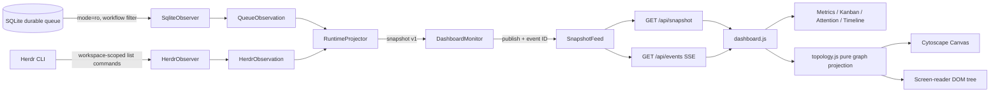
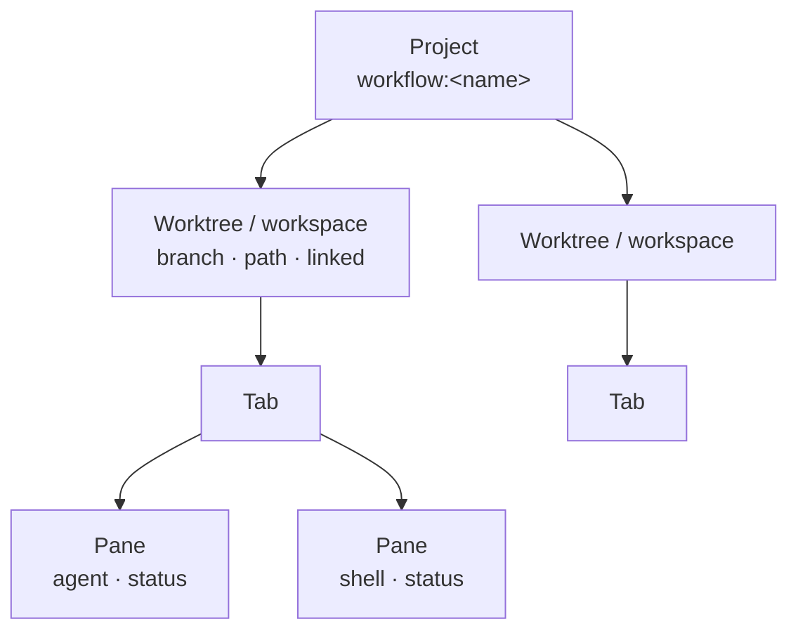

# 本地 Dashboard
Active contributors: oldwinter, chendongdong

Active contributors: oldwinter, chendongdong

> **Criticality：Critical。** Dashboard 是本地运行态的主要可观测入口，但始终是只读投影，不是第二个 coordinator，也不拥有重试、调度或修改 Herdr runtime 的权限。

## Purpose

本地 Dashboard 将两个事实源合并成一份实时、可关联的运行快照：

- SQLite 中 durable queue 的 job、lease、验证结果与 receipt；
- Herdr 中与当前仓库相关的 workspace、原生 Git worktree、tab、pane 和 agent lifecycle。

页面提供 workflow 汇总、按 durable state 分列的任务看板、attention 队列、最近生命周期事件，以及可平移和缩放的 `project → worktree → tab → pane` Canvas。它只解释已经观测到的状态，不估算完成百分比，也不把 `agent_settled` 或 Herdr 的 `idle`/`done` 等同于任务正确；需要声明 task receipt 的任务仍以 `task_verified=true` 为成功依据。

## 目录布局

```text
src/herdr_orchestrator/dashboard/
├── observer.py                 # SQLite 与 Herdr 的边界观察器
├── projector.py                # 关联、漂移检测、attention 与 snapshot v1 投影
├── server.py                   # poll monitor、feed、HTTP/SSE 与安全响应头
└── static/
    ├── index.html              # 页面语义结构与可访问性锚点
    ├── dashboard.js            # DOM 渲染、SSE、Canvas 生命周期与 viewport
    ├── topology.js             # 纯拓扑投影、签名和确定性 preset 布局
    ├── dashboard.css           # 页面与拓扑视觉样式
    ├── cytoscape.min.js        # 自托管 Cytoscape Canvas renderer
    └── cytoscape.LICENSE.txt

tests/
├── test_dashboard.py           # observer/projector/feed/HTTP/安全边界契约
└── test_topology_js.py         # Node 驱动的无 DOM 拓扑契约

docs/dashboard.md               # 用户侧启动、页面和 HTTP 接口说明
```

## 关键抽象

### Observer：限制事实源边界

`SqliteObserver` 使用 SQLite URI `mode=ro` 和 workflow 条件读取 jobs、receipts。查询显式枚举列，刻意不读取 `jobs.prompt`。结果分别冻结为 `QueueObservation.jobs` 与 `QueueObservation.receipts`。

`HerdrObserver` 通过 `run_json` 调用 Herdr 控制命令，单次命令 timeout 为 10 秒：

1. 获取 agent、workspace 和当前仓库下的 worktree；
2. 根据 workspace 的 repo/checkout、worktree path 和 agent cwd 求出相关 workspace ID；
3. 按 ID 获取 tab 与 pane；
4. 仅保留各实体的白名单字段，并再次按仓库路径收窄 worktree。

Herdr transport 失败不会伪造空的健康运行态，而是返回 `HerdrObservation.unavailable(error_code)`，供 projector 生成 source health 与 critical attention。

### Projector：从观测生成稳定 snapshot

`RuntimeProjector.snapshot()` 是服务端唯一投影视图，输出 `schema_version: 1`，主要分区如下：

| 分区 | 含义 |
| --- | --- |
| `source_health` | queue 与 Herdr 观测健康度 |
| `summary` | durable state、活跃 agent、linked worktree、attention 计数 |
| `jobs` | durable job 与按 `agent_name` 关联的实时 agent、runtime drift |
| `attention` | blocked/failed、来源不可用、漂移、过久无 durable 变化 |
| `topology` | 兼容的 `workspaces` 视图和新增的 `projects` compound 视图 |
| `timeline` | job enqueue 与 receipt 事件，按时间倒序最多 100 条 |

当前漂移规则包括：running job 缺少 agent、terminal job 的 agent 仍在 working、workspace 不一致，以及 running lease 已过期。running job 超过 5 分钟没有 durable state change 会额外产生 `job_stale` attention。所有诊断均只读，不触发恢复或重试。

### Feed 与 Monitor：线程间发布最新值

`DashboardMonitor` 以配置的 poll interval 调用 projector，并把每次结果发布到 `SnapshotFeed`。Feed 以 `threading.Condition` 保护递增 event ID 与最新 snapshot，支持读取当前值和等待比指定 ID 更新的值。

如果投影抛出未处理异常，monitor 仍发布一份降级 snapshot，只暴露异常类型，并将 queue 标为 unavailable；后台线程不会因此永久停止。浏览器给出超前的 `Last-Event-ID` 时，feed 会把当前 event ID 与 snapshot 发回，帮助客户端重新同步。

### HTTP/SSE：同一 feed 的两种读取方式

`DashboardServer` 仅提供 GET：

| 路径 | 数据 |
| --- | --- |
| `/`、`/assets/*` | 打包后的页面和严格白名单静态资源 |
| `/api/health` | 是否已有 snapshot 及当前 event ID |
| `/api/snapshot` | 首屏/恢复使用的当前完整 snapshot |
| `/api/events` | `snapshot` 类型的 SSE 流 |

SSE 使用 event ID 支持重连，每 15 秒无新 snapshot 时发送注释 heartbeat。浏览器先 `fetch("/api/snapshot")`，再通过 `EventSource("/api/events")` 持续接收完整快照；EventSource 自行负责断线重连。

## 端到端数据流



这一链路没有反向控制边：页面选择节点、缩放、平移都只改变浏览器内状态，不会 focus pane、修改 queue 或调用 Herdr 写操作。

## Project / Worktree / Tab / Pane compound graph

服务端 `_topology()` 先把 agent 按 `pane_id` 挂到 pane，再依次组成 pane-by-tab、tab-by-workspace。`open_workspace_id` 将原生 worktree 与 workspace 关联；每个相关 workspace 投影成一个 worktree 节点，最外层 project 以 workflow 名称标识。为保持 snapshot v1 兼容，`topology.workspaces` 继续存在，`topology.projects` 是 additive 字段。



浏览器端 `normalizedProjects()` 优先使用 `topology.projects`，旧快照只有 `topology.workspaces` 时则合成同等 project/worktree 层级。`topologyGraph()` 生成 Cytoscape compound nodes：层级关系保存在节点 `parent` 字段，而不是额外创建业务 edge。agent 是 pane 的内容与状态，不是第五层节点。

`topologyId()` 将稳定业务标识通过 `encodeURIComponent` 编入节点 ID；缺少标识时才使用同层索引作为 fallback。节点 class 同时表达 kind、focused、linked 和规范化后的 agent status。

## 确定性布局与增量刷新

`topology.js` 不访问 DOM、浏览器 API 或 Cytoscape，因此可以在 Node 中直接 fixture-test。`topologyPresetPositions()` 对相同的有序输入始终产生相同坐标：

- project 纵向分组；
- 同一 project 的 worktree 横向排列；
- worktree 内 tab 纵向排列；
- tab 内 pane 最多两列，再按行扩展；
- 有子节点的 compound parent 由 Cytoscape 包裹后代，只有 pane 和无子节点容器获得显式位置。

图构建同时返回两个签名：

| 签名 | 构成 | 用途 |
| --- | --- | --- |
| `structureSignature` | 每个节点的 `[id, parent]` | 判断 project/worktree/tab/pane 结构是否变化 |
| `contentSignature` | 每个节点的完整 `data` 与 `classes` | 判断标签、详情、focused、agent status 等内容是否变化 |

`dashboard.js` 的更新顺序保证状态刷新不抖动：

1. content signature 未变时完全跳过 Canvas 更新；
2. content 变化时在 Cytoscape batch 中按 ID 增删节点并更新 data/classes；
3. 仅 structure signature 变化时运行 `preset` layout；
4. 首次渲染或用户尚未碰过 viewport 时自动 fit，否则恢复已有 zoom/pan；
5. 若原选中节点仍存在，则恢复选择和 inspector。

因此 status-only SSE 更新会改变 pane 样式和文字，却不会重新布局；新增或删除层级节点才触发布局。

## Accessibility

Canvas 不是唯一信息载体。当前页面提供以下可访问性路径：

- topology 容器可聚焦，使用 `role="application"`，并按实体计数动态更新 `aria-label`；
- `+`/`=`、`-`、`0`/`Home` 分别对应放大、缩小和适配全部节点，工具栏按钮也有 `aria-label` 与 `title`；
- `renderTopologyTree()` 同步维护隐藏但可供屏幕阅读器读取的 project/worktree/tab/pane DOM 树；
- connection、source warning、topology inspector 和文本 topology 使用 `aria-live`；
- Kanban 是可聚焦的 `region`，指标、面板和时间线使用语义化 section/article/heading；
- 视觉图例标记为 `aria-hidden`，避免与文本树重复播报。

文本树以 content signature 去重更新，既能反映 agent/status 变化，又避免每次 render 都重写 live region。

## 白名单、CSP 与 loopback 安全

Dashboard 的安全模型是“本地绑定 + 最小读取 + 最小响应面”：

1. **SQLite 白名单**：只读连接与显式列查询，不读取 prompt、环境变量或 secret。
2. **Herdr 白名单**：workspace/tab/pane/agent/worktree 分别经过字段集合过滤；不读取 terminal/pane output，且只保留当前仓库相关 topology。
3. **绑定限制**：构造器只接受 `127.0.0.1` 或 `localhost`，拒绝 `0.0.0.0` 等非 loopback host。
4. **Host 校验**：每个 GET 都要求 Host hostname 为 loopback 名称，且显式端口必须与 server port 相同；失败返回 421，降低 DNS rebinding 与错发请求风险。
5. **静态资源白名单**：只允许 `index.html`、CSS、Cytoscape、`topology.js` 和 `dashboard.js`，不能用 URL 遍历任意包文件。
6. **CSP**：`default-src/connect-src/style-src/script-src` 均限定 `'self'`；图片仅额外允许 `data:`；`base-uri`、`form-action`、`frame-ancestors` 均为 `'none'`。
7. **响应头**：静态资源和 JSON API 使用 `Cache-Control: no-store` 与 `X-Content-Type-Options: nosniff`；SSE `/api/events` 使用 `Cache-Control: no-cache`；静态页面另带 `Referrer-Policy: no-referrer`。
8. **无写接口**：没有 POST、retry、focus、blocked response、push 或 runtime mutation endpoint；Cytoscape 依赖也从本地打包资源加载。

这里的“只读”描述 dashboard 运行语义；server 启动时仍通过 `Store.initialize()` 确保 state DB 已初始化。更完整的仓库级边界见[安全模型](../security.md)。

## 集成点

- **Workflow 配置**：`DashboardServer` 从 `WorkflowConfig` 获取 workflow name、`state_db` 和 workspace；默认 poll 为 2 秒，允许范围为 0.25–60 秒。
- **Durable store**：observer 依赖 jobs/receipts 的兼容 schema；新增或迁移字段时必须保持旧 snapshot 消费者可用。
- **Herdr protocol**：所有 CLI JSON 都经 `Command`/`run_json` 与 `TransportError` 边界；observer 不直接解析终端文本。
- **浏览器资源**：`index.html` 的脚本顺序固定为 Cytoscape、`topology.js`、`dashboard.js`，因为后者使用前者暴露的 classic-script globals。
- **自动化入口**：通常通过 `just dashboard` 启动，启动结果与 HTTP health/snapshot 接口适合 automation。
- **测试**：Python 契约覆盖 observer、projection、feed、HTTP、CSP、Host 与 loopback；Node 契约固定 compound graph、签名、布局、v1 fallback、ID 和 status class。

接口字段导航见 [API 索引](../api/index.md)，attention 与 runtime drift 的产品语义见[可观测性与 Attention](../features/observability-and-attention.md)。

## 修改入口

| 目标 | 首要修改位置 | 必须维护的契约 |
| --- | --- | --- |
| 新增 queue/receipt 展示字段 | `observer.py`、`projector.py`、`dashboard.js` | SQL 显式列、敏感字段不读取、snapshot 向后兼容 |
| 调整 drift/attention/summary | `projector.py` | durable 与 runtime 语义不能混淆；补 projector 测试 |
| 改 compound 层级、ID 或布局 | `static/topology.js` | 纯函数、稳定 ID、确定性坐标、双签名语义；补 Node fixture |
| 改 Canvas 更新或 viewport 行为 | `static/dashboard.js` | status-only 更新不移动节点；选择和用户 viewport 可恢复 |
| 改页面语义或控件 | `static/index.html`、`static/dashboard.js`、`static/dashboard.css` | 键盘路径、live region、屏幕阅读器文本树 |
| 新增 HTTP endpoint/asset | `server.py` | loopback、Host/asset 白名单、no-store、CSP；不引入写操作 |
| 改观察范围或 Herdr 字段 | `observer.py` | repo path scope、字段白名单、10 秒 timeout、失败健康度 |
| 改 snapshot 轮询/SSE | `server.py` | event ID 单调、15 秒 heartbeat、异常降级与断线重连 |

推荐先在纯投影层定义字段或结构，再依次更新浏览器渲染与测试；不要在 `dashboard.js` 中重新推导 durable truth，也不要让页面成为 coordinator 的旁路控制面。

## 关键源文件

| 文件 | 责任与阅读重点 |
| --- | --- |
| `src/herdr_orchestrator/dashboard/observer.py` | SQLite `mode=ro`、Herdr workspace scope、字段白名单和 unavailable 降级 |
| `src/herdr_orchestrator/dashboard/projector.py` | snapshot v1、job-agent 关联、drift、attention、compound topology 和 timeline |
| `src/herdr_orchestrator/dashboard/server.py` | `SnapshotFeed`、poll monitor、HTTP/SSE、loopback/Host/asset/CSP 边界 |
| `src/herdr_orchestrator/dashboard/static/index.html` | 页面层级、Canvas 容器、键盘焦点、ARIA 与隐藏文本树目标 |
| `src/herdr_orchestrator/dashboard/static/dashboard.js` | 首屏 fetch、EventSource、DOM panels、Cytoscape 增量更新和 viewport 保留 |
| `src/herdr_orchestrator/dashboard/static/topology.js` | 无 DOM 的 normalization、compound graph、稳定签名、preset positions 与 ID |
| `tests/test_dashboard.py` | prompt 不泄漏、scope/白名单、投影/漂移、feed、静态资源、CSP、Host/绑定测试 |
| `tests/test_topology_js.py` | Node fixture 对嵌套、状态 class、签名稳定、布局确定性、fallback 与 ID 的契约 |
| `docs/dashboard.md` | 面向操作者的启动方式、页面行为、数据安全与 HTTP 路径说明 |
