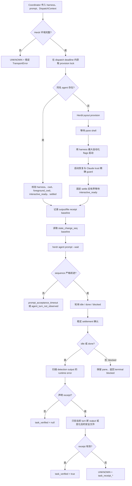
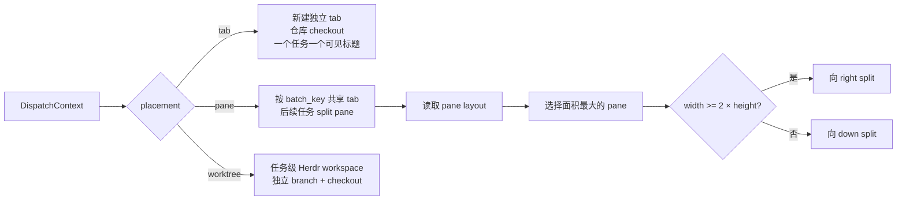

# Herdr runtime
Active contributors: oldwinter, chendongdong

Active contributors: oldwinter, chendongdong

> **Critical**：Herdr 是六种 harness 的交互式终端运行时，不是推理主控。Coordinator 决定任务是否入队、placement、lease、重试与验收；本层只把一次已接受的任务安全地映射为 Herdr workspace/tab/pane/worktree、PTY 输入和可验证的生命周期结果。

## Purpose

Herdr runtime 层解决三个问题：

1. **终端拓扑**：按 `tab`、`pane` 或 `worktree` placement 创建或复用执行位置，并保持用户可见标题与内部 agent identity 分离。
2. **交互式生命周期**：证明 shell 已就绪、harness 已可交互、prompt 确实触发了新 turn，最后得到稳定的 `idle`、`done` 或 `blocked`。
3. **机器可判定结果**：把 Herdr CLI/PTY 的状态与有限输出转换为稳定错误码、phase timing、runtime error 和 task receipt；`idle`/`done` 本身不等于任务正确。

核心边界是：**Provisioned → Interactive ready → Turn observed → Settled → Receipt verified**。只有最后一步成功时，声明了 receipt 的任务才有 `task_verified=true`。

## 目录布局

```text

├── src/herdr_orchestrator/
│   ├── herdr.py                 # transport、agent 生命周期、错误检测、receipt
│   ├── herdr_layout.py          # tab/pane/worktree 的创建、复用与清理
│   ├── protocol.py              # Herdr 子进程协议与 TransportError
│   └── topology.py              # placement 决策、短标题与稳定 slug
├── tests/
│   ├── test_herdr.py            # 生命周期、sequence、settlement、error、receipt
│   ├── test_herdr_layout.py     # 三种拓扑和清理所有权
│   └── test_harness_automation.py # 最大自动化参数与 Claude trust guard
└── docs/
    └── runtime-troubleshooting.md # 真实演练形成的诊断契约
```

上述每个相对树节点对应的完整源路径见文末“关键源文件”表。

## 关键抽象

| 抽象 | 职责与不变量 |
| --- | --- |
| `HerdrTransport` | 一次 dispatch 的总入口；检查 Herdr 环境、串行化 provision、设置全局 deadline、驱动 prompt/settlement/runtime error/receipt，并返回 `DispatchOutcome`。 |
| `HerdrLayout` | 将 `DispatchContext.placement` 映射为原生 Herdr tab、共享 batch pane 或 worktree workspace。 |
| `ProvisionedTerminal` | 记录 `pane_id`、`tab_id`、`workspace_id`、真实 `cwd`、placement 以及失败时允许清理的对象。 |
| `DispatchContext` | 携带 placement、用户可见 title、稳定 task key、可选 `batch_key`、worktree root 和 receipt。 |
| `DispatchOutcome` | 对外暴露 state、pane/workspace/execution path、是否复用、稳定错误码、`agent_settled`、`task_verified` 与 phase timings。 |
| `Command` / `CommandRunner` | 隔离 Herdr CLI 调用，便于把 subprocess 替换为确定性的测试 runner。 |
| `TransportError` | 以受约束的 snake_case code 穿透协议、布局和生命周期层；可附带 exit code、有界 summary，以及“错误发生时 agent 已 settled”的证据。 |
| `state_change_seq` | turn identity 的核心证据。prompt 前取 baseline，只有新值严格大于 baseline 才证明本次输入产生了新 turn。 |

Agent 名称是内部稳定 identity，不是 tab 标题：

- 单副本 tab agent：`ho-<harness>-<8位摘要>`，摘要来自 workflow、仓库绝对路径和 harness。
- 多副本：`ho-<harness>-<两位槽号>-<6位摘要>`，名称最长 32 字符。
- worktree agent：任务级名称包含 job id；worktree 不复用普通 replica slot。
- tab label 来自任务 title，经压缩后最长 32 字符；复用 tab 时只 rename label，不改 agent name。

## 总控制流



`dispatch()` 设置一个 thread-local 总 deadline；`_bounded_runner()` 将每个 Herdr 控制命令自己的 timeout 再裁剪到剩余总时长。因此 start、wait、prompt、poll 和 receipt read 都不能越过一次 dispatch 的预算。只有 provision 临界区受 `_provision_lock` 保护，长时间运行的 agent turn 不持有该锁。

## Provision 与 readiness

### 环境门禁

调用 Herdr 前必须同时满足：

- `HERDR_ENV=1`，否则 `not_in_herdr`；
- 存在 `HERDR_PANE_ID`，否则 `herdr_pane_id_missing`；
- 存在 `HERDR_WORKSPACE_ID`，否则 `herdr_workspace_id_missing`。

### 复用既有 agent

`herdr agent get <name>` 成功时不会重新 provision。复用前必须证明：

1. 可选的 live `name` 与请求 identity 相同；
2. `agent` 字段等于请求 harness；
3. `cwd` 与 `foreground_cwd` 都精确等于 placement 的 execution workspace；
4. `interactive_ready` 是布尔值 `true`；
5. 状态是 `idle` 或 `done`，不能是 `working` 或 `blocked`。

任一 identity、workspace、readiness 或 settlement 条件不满足都拒绝复用。显式 context 下复用 tab 只刷新可见 label。

### 新建 agent

新 terminal 的顺序是：

1. `HerdrLayout.provision()` 创建原生 terminal。
2. 最多等待 10 秒，直到 `herdr pane process-info` 的 foreground processes 中出现 `shell_pid`；否则 `pane_shell_not_ready`。
3. 执行 `herdr agent start`。`agent_pane_busy` 最多重试两次，总计三次 attempt，每次间隔 1 秒。
4. start 返回 `working` 等非终态时，用 `herdr agent wait` 做恢复；`agent_not_ready` 也进入有界恢复路径。
5. start 后固定等待 3 秒，再最多等待 10 秒反复读取 `interactive_ready`。这一步重新验证 harness、pane identity 和最终状态，不能把固定 sleep 当作 readiness 证据。

startup 仍为 `blocked` 或总 timeout 时保留本次创建的 terminal，便于人工诊断/恢复；其他启动错误会清理本层新建的 tab/pane。worktree 是持久任务证据，任何失败都不会自动删除其 checkout、branch 或 Herdr workspace。

## 最大自动化参数

`herdr agent start ... -- <native arguments>` 对六种 harness 固定传入：

| Harness | 原生参数 |
| --- | --- |
| Droid | `--auto high` |
| Grok | `--always-approve --permission-mode bypassPermissions` |
| Codex | `--dangerously-bypass-approvals-and-sandbox --dangerously-bypass-hook-trust` |
| Pi | `--approve` |
| Claude | `--dangerously-skip-permissions` |
| Hermes | `--yolo --accept-hooks` |

这些 flags 只负责最大化 harness 自身的无人值守能力；Coordinator 的队列、receipt、production/secret 边界和 `blocked` 处理不会因此被绕过。

### Claude workspace trust 的精确 guard

自动按 Enter 只允许处理 **Claude 的已知 workspace trust 首屏**，不能回答登录、授权或任意其他 block。guard 同时要求：

1. harness 必须严格是 `Harness.CLAUDE`；
2. 从 `herdr agent read <name> --source detection --lines 160` 读取有限输出成功；
3. 输出同时包含三个 marker：`Accessing workspace:`、`Quick safety check:`、`Yes, I trust this folder`；
4. 当前 placement 的 `execution_workspace.resolve()` 必须以**独立整行**出现在输出中；匹配允许该行首尾空白，但不允许不同路径或子串命中；
5. 以上条件全部满足才调用 `herdr agent send-keys <name> enter`，然后 `herdr agent wait`。

该 guard 只会在 start 抛出 `agent_not_ready`，或 start payload 明确为 `blocked` 时尝试。读取失败、缺 marker、workspace 不同、认证提示等情况均返回 false，不发送任何按键。

## Prompt、sequence 与 settlement

### Prompt acceptance

1. prompt 前用 `agent get` 记录 `baseline_sequence`。
2. 调用 `herdr agent prompt <name> <prompt> --wait --timeout <ms>`；内部 Herdr wait timeout 比剩余 command budget 少 1 秒，为 reconciliation 留出空间。
3. 返回的 `state_change_seq` 必须严格大于 baseline。即使返回 `done`，sequence 未变化也会得到 `agent_turn_not_observed`。
4. `agent_prompt_stalled`、`timeout` 或 `herdr_timeout` 后先 `agent get` 对账，而不是立即判失败：
   - timeout 且 sequence 未前进：`prompt_acceptance_timeout`，summary 包含 phase、耗时、state 和 sequence；
   - sequence 已前进且为 `working`：继续等待；
   - stalled 且仍 `idle`/原 sequence：最多发送两次 Enter，每次后重新读取 sequence；
   - 两次 Enter 后仍未前进：`agent_turn_not_observed`。

这一区分避免两类误判：把“prompt 命令超时但 turn 已开始”误判为未执行，或把“旧 settled snapshot”误判为本次任务成功。

### Settlement

观察到新 sequence 后：

- `working`：每 0.5 秒轮询，直至总 deadline；
- `idle` / `done`：默认要求连续 6 次、每次间隔 0.5 秒的 settled confirmation；
- confirmation 中若重新进入 `working`，计数清零；
- `blocked`：立即作为该 turn 的终端交互状态返回，不做六次稳定轮询；
- 未知状态或缺少严格类型字段：`herdr_invalid_response` / `agent_not_settled`；
- deadline 耗尽：`herdr_timeout`。

实现中的 `SETTLED_STATES` 只包含 `idle` 和 `done`。`blocked` 虽然会终止当前 turn，但 `agent_settled` 仍为 false，receipt 也不会被验为 true；普通 queue 不自动回答它。

### 回答 blocked agent

显式恢复走 `respond()`，不能重新走普通 prompt：

1. 确认当前状态仍为 `blocked`；
2. 在提供 expected pane 时，严格校验 agent name、pane id，以及 `cwd`/`foreground_cwd` 位于预期 execution workspace；
3. 用 `herdr pane send-text <pane> <literal response>` 输入文本；
4. 用 `herdr agent send-keys <name> enter` 提交；
5. 等待 `state_change_seq` 高于 blocked baseline，再做 settlement、runtime error 和 receipt 验证。

这既支持人工 `resume`，也支持明确启用的 principal-proxy 流程，同时防止把回答发到已移动或被复用的 pane。更多恢复语义见[收据与恢复](../features/receipts-and-recovery.md)。

## Runtime error

agent 到达 `idle`/`done` 后，transport 默认读取 `detection` source 最近 80 行。按以下优先级匹配：

| 稳定错误码 | 检测信号 |
| --- | --- |
| `agent_model_invalid` | invalid/unknown/unsupported/not-found model identifier；优先于同屏 provider retry 文本。 |
| `agent_provider_failed` | `API` 或 `provider failed after N retries/attempts`。 |
| `agent_auth_failed` | HTTP/API 401/403、authentication/authorization failed、invalid/expired key/token/credentials；另含 Claude 的 `⏺ Please run /login ... API Error: 401/403`。 |
| `agent_auth_required` | device login、login/sign-in required、not logged in、`/login`、waiting for authentication。 |

命中后返回 `UNKNOWN` 与稳定 code，但保留 `agent_settled=true`，说明失败来自 settled output 的语义检查而非生命周期超时。`error_summary` 只保留匹配片段，压平空白并截断到 300 字符。可通过构造参数关闭扫描，单元测试借此隔离 lifecycle，但生产 dispatch 默认启用。

协议层把 subprocess timeout 映射为 `herdr_timeout`，OS 启动错误映射为 `herdr_unavailable`。JSON 命令必须返回顶层 object，且含 object 类型的 `result`；非零退出只接受 stderr JSON 中满足 `[a-z][a-z0-9_]{0,63}` 的 error code，否则统一为 `herdr_command_failed`。

## Receipt 验证

receipt baseline 在 agent provision/readiness 完成后、prompt 前记录；验证在 turn settlement 和 runtime error 检查之后进行。

### `output_prefix`

- 前后都读取 `recent-unwrapped` 最近 120 行，只在 baseline 后的新增行中寻找 prefix；
- 允许 prefix 直接位于行首，或位于已知 assistant UI marker `⧬`、`⏺`、`•`、`●`、`◆`、`◇`、`✦` 之后；
- prefix 若作为独立行出现在 prompt 中，直接报 `task_receipt_ambiguous`，防止 prompt echo 冒充 agent 输出；
- 旧 turn 已存在的 prefix 不算新 receipt；
- 缺失返回 `task_receipt_missing`。

### `file`

- receipt 必须是 execution workspace 下的相对路径；
- 拒绝绝对路径、空路径、任何 `..`、路径任一组件的 symlink，以及 resolve 后逃逸 workspace 的路径；
- prompt 前记录 `{exists, size, sha256}`；
- prompt 后文件必须存在、非空，且 snapshot 与 baseline 不同；
- 缺失为 `task_receipt_missing`，空文件为 `task_receipt_invalid`，未变化为 `task_receipt_stale`，读取失败为 `task_receipt_unreadable`。

若 turn 返回 `blocked` 或其他非 `idle`/`done` 状态，即使屏幕上出现 prefix，也直接令 `task_verified=false`。未声明 receipt 时值为 `null`，不是隐式 true。详见[收据与恢复](../features/receipts-and-recovery.md)。

## Tab、pane 与 worktree



| Placement | 创建/复用 | execution workspace | 清理策略 |
| --- | --- | --- | --- |
| `tab` | `herdr tab create --workspace ... --cwd ... --label ... --no-focus`；复用时刷新 tab label。 | 仓库根 checkout。 | provision 失败可关新 tab；显式 cleanup 只关闭经 ownership 校验的 agent pane，不因 tab 后来被用户移动而关闭整个用户 tab。 |
| `pane` | 同一 `batch_key` 首任务创建 batch tab，后续任务从当前 layout 选择最大 pane 并 split。 | 仓库根 checkout。 | batch 根失败时关闭 tab 并从内存 cache 移除；子 pane 失败只关该 pane。 |
| `worktree` | 不存在时 `herdr worktree create --branch ... --base HEAD --path ... --no-focus`；已存在时优先查找其 open workspace/pane，否则 `worktree open`。 | 确定性的任务级 worktree 路径。 | 永不自动删除；`close_agent_terminal()` 明确拒绝 worktree cleanup。 |

worktree identifier 为 `<title-slug>-<sha256(workflow + NUL + task_key)前7位>`；路径为 `<worktree_root>/<workflow-slug>/<identifier>`，branch 为 `ho/<workflow-slug>/<identifier>`。因此同一 workflow/task key 可恢复到同一 checkout。标题和 slug 只用于可见性/稳定坐标，不替代 agent identity。

显式关闭普通 terminal 前还会验证 agent name、expected pane、当前 Herdr workspace、`cwd`/`foreground_cwd` 仍在仓库根内，并要求状态为 `idle`/`done`。这保证只关闭本次运行拥有且已 settled 的 pane，不关闭用户或其他运行创建的 terminal。

拓扑选择本身由静态信号或受 schema 约束的决策输出完成，而不是由 Herdr 推断。只读强信号优先选 pane，写任务在 Git 仓库可选 worktree，非 hybrid mode/override/worker default 则直接决定 placement。完整策略见[拓扑感知派发](../features/topology-aware-dispatch.md)。

## 集成点

- **Coordinator / durable queue**：提供 harness、timeout、稳定 agent slot 和 `DispatchContext`；消费 `DispatchOutcome` 的 placement、execution path、workspace id、错误、settlement、verification 和 phase timings，决定重试或 terminal 状态。
- **Topology router**：`static_placement()` 先应用显式 override、worker default 和固定 mode；hybrid 下按 hard read-only、write、read 信号决策，仍不明确时生成只允许 `pane|tab|worktree` 的精确 JSON schema。
- **Harness profiles**：profile 负责能力与选择；runtime 只在具体 harness 已被选中后注入相应 native automation flags。
- **Recovery**：普通 queue 的 `blocked` 不自动回答；显式 resume 复用原 agent、pane 和 attempt。只有 opt-in principal proxy 才可调用受控 response loop。
- **Receipts**：queue 可声明 output prefix 或 file；runtime 只报告证据，不能用 settled state 替代验收。
- **Dashboard / status / doctor**：读取 outcome 和 durable receipt 投影；诊断顺序是 queue 状态 → 结构化 `agent get/explain` → 有限 detection/recent output → integration status。

相关页面：

- [拓扑感知派发](../features/topology-aware-dispatch.md)
- [Harness readiness 与自动化](../features/harness-readiness-and-automation.md)
- [收据与恢复](../features/receipts-and-recovery.md)

## 修改入口

| 修改目标 | 首要入口 | 必须同步验证 |
| --- | --- | --- |
| 改 agent start、deadline、readiness、prompt 或 settlement | `src/herdr_orchestrator/herdr.py` | `tests/test_herdr.py` |
| 改六 harness 的最大自动化 flags 或 Claude trust guard | `src/herdr_orchestrator/herdr.py` | `tests/test_harness_automation.py` |
| 改 tab/pane/worktree 命令、split 启发式、label 或 cleanup ownership | `src/herdr_orchestrator/herdr_layout.py` | `tests/test_herdr_layout.py` 与 `tests/test_herdr.py` |
| 改 Herdr JSON envelope、stderr code 或 subprocess 映射 | `src/herdr_orchestrator/protocol.py` | 增加/更新调用该协议的 transport 测试 |
| 改 placement 信号、决策 schema、slug 或短标题 | `src/herdr_orchestrator/topology.py` | 更新 topology 与 layout 相关测试 |
| 改 runtime error 正则或优先级 | `src/herdr_orchestrator/herdr.py` | 为每个信号和冲突优先级补 `tests/test_herdr.py` 回归测试 |
| 改 receipt 新鲜度或路径安全规则 | `src/herdr_orchestrator/herdr.py` | 覆盖 prompt echo、旧 output、空/旧/新 file、symlink 与路径逃逸 |

生命周期改动的最小收口命令是：

```bash
cd .
PYTHONPATH=src python3 -m unittest -v tests.test_herdr tests.test_herdr_layout tests.test_harness_automation
just check
```

真实连通性验证应从单 harness、只读 smoke 开始，不要先扩大为六 harness 写任务。

## 关键源文件

| 完整路径 | 作用 |
| --- | --- |
| `src/herdr_orchestrator/herdr.py` | `HerdrTransport`、stable agent naming、startup/prompt/settlement、runtime error、blocked response 与 receipt 真源。 |
| `src/herdr_orchestrator/herdr_layout.py` | `HerdrLayout`、`ProvisionedTerminal` 和三种原生 Herdr topology 真源。 |
| `src/herdr_orchestrator/protocol.py` | Herdr subprocess/JSON 协议、error-code 规范化与 `TransportError`。 |
| `src/herdr_orchestrator/topology.py` | placement 静态/动态决策输入、严格输出解析、label 和 slug。 |
| `tests/test_herdr.py` | transport 行为契约：复用、readiness、sequence、timeout reconciliation、settlement、errors、receipts、resume 与 ownership。 |
| `tests/test_herdr_layout.py` | tab label、batch pane split、cache cleanup 和 worktree retention 契约。 |
| `tests/test_harness_automation.py` | 六 harness flags 以及 Claude trust prompt 正反例契约。 |
| `docs/runtime-troubleshooting.md` | 运行时四层证据、诊断顺序、稳定错误码与真实演练经验。 |
