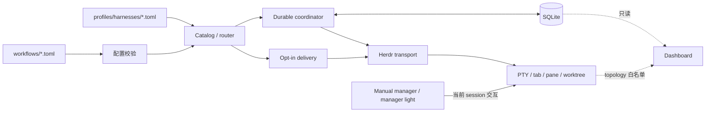

# 系统总览
Active contributors: oldwinter, chendongdong

## Purpose

本节用 system lens 说明 Herdr Orchestrator 的运行边界。项目是 Python 3.12 标准库为主的本地优先多 harness 控制面：确定性 coordinator 拥有 SQLite durable queue、lease、replica、retry、resume、GC 和机器 receipt；Herdr 只提供真实 PTY、agent lifecycle 与 tab、pane、worktree。Node.js 不参与调度，只承担 npm 分发、runtime wrapper 和插件入口。

普通 queue、标准化交付、manual manager 和 Dashboard 是四个独立运行面。它们可以共享 harness catalog 或 Herdr CLI，但不能混用状态语义：

| 系统 lens | 页面 | 核心边界 |
| --- | --- | --- |
| Queue 与 coordinator | [Coordinator 与 durable queue](coordinator-and-queue.md) | SQLite 是状态真源；Python 决定 claim、lease、attempt、重试、resume、GC 和成功判定。 |
| Herdr runtime | [Herdr runtime](herdr-runtime.md) | 把一次已接受的 dispatch 映射到 PTY、agent 和 placement，不决定任务是否入队。 |
| Catalog 与 routing | [Harness catalog 与路由](catalog-and-routing.md) | Router 只见紧凑 catalog；选中 worker 后才加载完整 profile。 |
| Dashboard | [本地 Dashboard](dashboard.md) | 只读投影 queue、attention、receipt timeline 与 Herdr topology，不进入控制回路。 |
| Standardized delivery | [标准化交付](standardized-delivery.md) | 仅在显式 `deliver` 或 Skill 触发后运行独立的 spec、ticket DAG、review 和 repair 阶段机。 |
| Manual Manager | [手动 Manager](manual-manager.md) | `just manager [harness]` 或 `npx herdr-manager` 在当前 Herdr session 启动一个交互式 operator；没有 queue、lease、retry 或 receipt。 |
| Manager Light | [Manager Light 侧栏投影](manager-light.md) | 可选 Herdr 插件只把当前 pane/process 事实投影为互斥 sidebar metadata token，不启动 Manager，也不拥有 lifecycle。 |
| Installation | [安装与分发](installation-and-distribution.md) | `herdr-orchestrator` npm 包负责安装、诊断、升级、卸载与 Python runtime 转发。 |

从用户能力视角继续阅读[持久执行](../features/durable-execution.md)和[收据与恢复](../features/receipts-and-recovery.md)；从命令契约进入 [CLI contracts](../api/cli-contracts.md)。

## 目录布局

```text
src/herdr_orchestrator/
├── runner.py                 # Durable queue coordinator
├── store.py                  # SQLite schema、claim、receipt 与恢复
├── herdr.py                  # Herdr transport 与 agent lifecycle
├── herdr_layout.py           # tab、pane、worktree provision
├── catalog.py                # 紧凑 catalog 与完整 profile 注入
├── planner.py                # Planner/router 输出协议
├── delivery.py               # Opt-in standardized delivery
└── dashboard/                # 只读 runtime projector、HTTP 与 SSE
profiles/harnesses/           # Harness TOML catalog 与 Markdown context
workflows/                    # 声明式 workflow 和 task prompt
manager/                      # Manual manager 的固定 workspace 与 policy
.agents/skills/               # 项目 Skill 真源
bin/herdr-orchestrator.mjs    # npm 安装器和 runtime wrapper
packages/herdr-manager/       # Manager light npm 入口
plugins/                      # Node 插件分发面
tests/                        # Python 行为契约
```

## 关键抽象

| 抽象 | 完整源码路径 | 责任 |
| --- | --- | --- |
| `WorkflowConfig` | `src/herdr_orchestrator/model.py` | 聚合 coordinator、placement、planner、worker、profile 与标准化交付配置。 |
| `Coordinator` | `src/herdr_orchestrator/runner.py` | 驱动普通 queue 的 placement、claim、并发 dispatch、drain、resume 和 GC。 |
| `Store` | `src/herdr_orchestrator/store.py` | 保存 job 最新投影、attempt receipt、lease 和轻量 metadata。 |
| `HerdrTransport` | `src/herdr_orchestrator/herdr.py` | 验证 Herdr 环境、启动或复用 agent，并证明 turn 与 receipt。 |
| `HerdrLayout` | `src/herdr_orchestrator/herdr_layout.py` | 创建和定位 tab、batch pane 与任务级 worktree。 |
| `HarnessProfile` | `src/herdr_orchestrator/model.py` | 连接 router 所见的紧凑元数据与 worker 所需的完整 context。 |
| `StandardizedDelivery` | `src/herdr_orchestrator/delivery.py` | 推进显式交付的阶段、ticket frontier、review 和有界 repair。 |
| `RuntimeProjector` | `src/herdr_orchestrator/dashboard/projector.py` | 将 SQLite 与 Herdr 白名单状态关联为只读 snapshot。 |

## 工作原理



1. `workflows/*.toml` 声明 queue 策略、worker、placement、planner 与可选 delivery 配置；`src/herdr_orchestrator/config.py` 在产生 `WorkflowConfig` 前 fail closed。
2. `profiles/harnesses/*.toml` 构成当前 workflow 可见的紧凑 catalog。自动 routing 或 planner 只能从允许的 worker pool 中选择 harness，不能提交 shell command。
3. 普通任务进入 `src/herdr_orchestrator/runner.py` 与 `src/herdr_orchestrator/store.py`。Coordinator 在事务内 claim 后，才加载所选 harness 的完整 Markdown profile 并交给 Herdr transport。
4. `src/herdr_orchestrator/herdr.py` 和 `src/herdr_orchestrator/herdr_layout.py` 负责真实 terminal、agent 与 lifecycle 证据；结构化 `DispatchOutcome` 回到 Store 后才折叠为 durable `JobState`。
5. 标准化交付由 `src/herdr_orchestrator/delivery.py` 推进自己的阶段机，不复用普通 queue 状态机。Manual manager 则只管理当前 session，不生成 durable receipt。
6. Dashboard 独立读取 SQLite 与有限 Herdr topology。它断线或退出不会改变 lease、job 或 agent。

## 集成点

- **配置与路由**：`workflows/*.toml`、`profiles/harnesses/*.toml` 和 `src/herdr_orchestrator/config.py` 共同限制 controller 与 worker 候选。详见 [Harness catalog 与路由](catalog-and-routing.md)。
- **Durable store**：普通 queue 的 job、attempt 与 receipt 只由 `src/herdr_orchestrator/store.py` 写入；字段语义见 [Job 与 receipt](../primitives/jobs-and-receipts.md)。
- **Placement**：Queue 和 transport 通过 `DispatchContext` 交换 placement 与 worktree 坐标；详见 [Placement 与 worktree](../primitives/placement-and-worktrees.md)。
- **命令面**：开发者优先使用 `justfile`；安装后的项目由 `bin/herdr-orchestrator.mjs` 固定项目路径并转发到 Python CLI。
- **诊断面**：Dashboard、`status` 和 `doctor` 只消费结构化状态。运行问题按[调试指南](../how-to-contribute/debugging.md)收窄，不把完整 terminal transcript 提交进 Git。

## 修改入口

| 想修改的系统 | 首要入口 | 继续阅读 |
| --- | --- | --- |
| Queue、lease、retry、resume、GC | `src/herdr_orchestrator/runner.py`、`src/herdr_orchestrator/store.py` | [Coordinator 与 durable queue](coordinator-and-queue.md) |
| Agent lifecycle、receipt、terminal topology | `src/herdr_orchestrator/herdr.py`、`src/herdr_orchestrator/herdr_layout.py` | [Herdr runtime](herdr-runtime.md) |
| Catalog、planner 或 worker routing | `src/herdr_orchestrator/catalog.py`、`src/herdr_orchestrator/planner.py` | [Harness catalog 与路由](catalog-and-routing.md) |
| Dashboard projection 或 SSE | `src/herdr_orchestrator/dashboard/` | [本地 Dashboard](dashboard.md) |
| Standardized delivery | `src/herdr_orchestrator/delivery.py`、`.agents/skills/standardized-delivery/` | [标准化交付](standardized-delivery.md) |
| Manual Manager policy 与 launcher | `manager/`、`bin/herdr-orchestrator.mjs`、`packages/herdr-manager/` | [手动 Manager](manual-manager.md) |
| Manager Light 配置与投影 | `plugins/manager-light/`、`bin/herdr-orchestrator.mjs` | [Manager Light 侧栏投影](manager-light.md) |
| npm 安装、升级与插件分发 | `bin/herdr-orchestrator.mjs`、`plugins/` | [安装与分发](installation-and-distribution.md) |

## Key source files

| 完整路径 | 作用 |
| --- | --- |
| `src/herdr_orchestrator/model.py` | 跨 queue、routing、runtime 与 delivery 共享的枚举和数据 packet。 |
| `src/herdr_orchestrator/config.py` | 声明式 workflow 的装载与跨字段校验。 |
| `src/herdr_orchestrator/runner.py` | 普通 durable queue 的确定性 coordinator。 |
| `src/herdr_orchestrator/store.py` | SQLite 状态真源与向后兼容 migration。 |
| `src/herdr_orchestrator/herdr.py` | Herdr agent transport、lifecycle 与机器 receipt。 |
| `src/herdr_orchestrator/herdr_layout.py` | Herdr tab、pane、worktree 的原生布局 adapter。 |
| `src/herdr_orchestrator/catalog.py` | Compact catalog 和按需 profile 注入。 |
| `src/herdr_orchestrator/delivery.py` | Opt-in standardized delivery 阶段机。 |
| `src/herdr_orchestrator/dashboard/projector.py` | Queue 与 runtime 的只读关联投影。 |
| `manager/AGENTS.md` | Manual manager 的 canonical policy。 |
| `manager/CLAUDE.md` | Claude Code 进入固定 manager workspace 的 adapter。 |
| `packages/herdr-manager/bin/herdr-manager.mjs` | `npx herdr-manager` 的固定 argv 薄入口。 |
| `plugins/manager-light/` | Manager Light 的配置事务、事件协调与 sidebar metadata 投影。 |
| `bin/herdr-orchestrator.mjs` | npm 安装、诊断、升级、卸载和 runtime wrapper。 |
