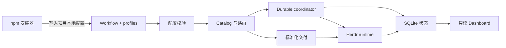

# 核心系统
Active contributors: oldwinter, chendongdong

Active contributors: oldwinter, chendongdong

## Purpose

Herdr Orchestrator 的核心系统把声明式 workflow 转换为可恢复的多 harness 执行：安装器提供项目本地运行面，catalog 和路由选择执行者，coordinator 管理 durable queue，Herdr adapter 承载交互式 agent，Dashboard 则投影运行状态。标准化交付是显式启用的独立运行面，不与普通 queue 混用。

本节包含六个系统页面：

- [Coordinator 与 durable queue](coordinator-and-queue.md)：claim、lease、并行波次、重试和状态持久化。
- [Herdr runtime](herdr-runtime.md)：agent 创建、pane/tab/worktree 放置、等待与启动自动化。
- [Harness catalog 与路由](catalog-and-routing.md)：紧凑 catalog、受限 router、planner 和完整 profile 的按需注入。
- [本地 Dashboard](dashboard.md)：queue、attention、拓扑和 receipt timeline 的只读实时投影。
- [标准化交付](standardized-delivery.md)：spec、ticket DAG、隔离实现、双轴 review 和有界 repair。
- [安装与分发](installation-and-distribution.md)：npm bootstrap、ownership manifest、项目 Skill 和发布流水线。

## 布局

```text
src/herdr_orchestrator/
├── catalog.py             # Harness profile catalog
├── config.py              # Workflow 装载与跨字段校验
├── planner.py             # Planner/router 提示与输出校验
├── selection.py           # Worker pool 与 controller 选择
├── runner.py              # Durable queue coordinator
├── store.py               # SQLite 状态与迁移
├── herdr.py               # Herdr transport
├── delivery.py            # 标准化交付控制器
└── dashboard/             # 只读 Web 投影
bin/
└── herdr-orchestrator.mjs # npm 安装器与 runtime wrapper
profiles/harnesses/        # 紧凑 TOML 与完整 Markdown profile
workflows/                 # 声明式 workflow 与任务提示
```

## 关键抽象

| 抽象 | 所在文件 | 作用 |
| --- | --- | --- |
| `WorkflowConfig` | `src/herdr_orchestrator/model.py` | 聚合 coordinator、placement、planner、worker、profile 和交付配置。 |
| `Coordinator` | `src/herdr_orchestrator/runner.py` | 驱动普通 durable queue 的 claim、dispatch、结果收口与恢复。 |
| `Store` | `src/herdr_orchestrator/store.py` | 保存 job、attempt、lease、receipt 和运行元数据。 |
| `HerdrTransport` | `src/herdr_orchestrator/herdr.py` | 把已选 harness 和任务上下文映射到 Herdr agent。 |
| `HarnessProfile` | `src/herdr_orchestrator/model.py` | 连接紧凑路由元数据与按需读取的完整执行上下文。 |
| `StandardizedDelivery` | `src/herdr_orchestrator/delivery.py` | 执行显式启用的规格化交付流水线。 |
| `DashboardServer` | `src/herdr_orchestrator/dashboard/server.py` | 将本地状态投影为只读 HTTP/SSE 界面。 |

## How it works



1. `bin/herdr-orchestrator.mjs` 安装项目相对 workflow、选定的 profiles 和可选 Skill，并把 runtime 命令转交给 Python CLI。
2. `src/herdr_orchestrator/config.py` 在启动时解析 TOML，校验 worker、planner、profile、runtime 路径和超时关系。
3. `src/herdr_orchestrator/catalog.py` 与 `src/herdr_orchestrator/selection.py` 限定候选 worker；需要自动路由时，controller 只能从紧凑 catalog 中返回一个受校验的 harness。
4. 普通任务进入 `src/herdr_orchestrator/runner.py` 和 `src/herdr_orchestrator/store.py` 管理的 durable queue；显式标准化交付则进入 `src/herdr_orchestrator/delivery.py`。
5. 两条运行面最终都通过 `src/herdr_orchestrator/herdr.py` 启动或复用 agent。Dashboard 只读取持久状态与 Herdr 拓扑，不参与调度决策。

## 集成点

- `workflows/*.toml` 是系统组装入口；字段细节见[配置参考](../reference/configuration.md)。
- `profiles/harnesses/*.toml` 为 router 提供紧凑能力描述，配套的 `profiles/harnesses/*.md` 只在已选 harness 执行前加载。
- `justfile` 为仓库开发提供稳定命令，npm 安装后的项目则通过 `bin/herdr-orchestrator.mjs` 固定 workflow 路径并转发参数。
- 普通 queue 和标准化交付共享 catalog、controller 选择与 Herdr transport，但使用不同的状态和完成协议。

## 修改入口

修改调度或恢复语义时，从 [Coordinator 与 durable queue](coordinator-and-queue.md) 对应的 `src/herdr_orchestrator/runner.py`、`src/herdr_orchestrator/store.py` 和行为测试开始。修改 harness 能力、自动选择或项目安装面时，分别从 [Harness catalog 与路由](catalog-and-routing.md) 和 [安装与分发](installation-and-distribution.md) 进入；不要只改生成后的项目文件。

## 关键源文件表

| 文件 | 作用 |
| --- | --- |
| `src/herdr_orchestrator/config.py` | 装载并校验整个 workflow。 |
| `src/herdr_orchestrator/catalog.py` | 装载、裁剪和按需展开 harness profile。 |
| `src/herdr_orchestrator/planner.py` | 定义 planner 与单任务 router 的受限 JSON 协议。 |
| `src/herdr_orchestrator/selection.py` | 计算 worker pool 和 controller。 |
| `src/herdr_orchestrator/runner.py` | 普通 durable queue 的主协调器。 |
| `src/herdr_orchestrator/store.py` | SQLite 状态真源。 |
| `src/herdr_orchestrator/herdr.py` | Herdr agent transport 与放置适配。 |
| `src/herdr_orchestrator/delivery.py` | Opt-in 标准化交付运行面。 |
| `src/herdr_orchestrator/dashboard/server.py` | Dashboard HTTP/SSE 服务。 |
| `bin/herdr-orchestrator.mjs` | npm 安装、诊断、升级、卸载和 runtime 包装入口。 |
