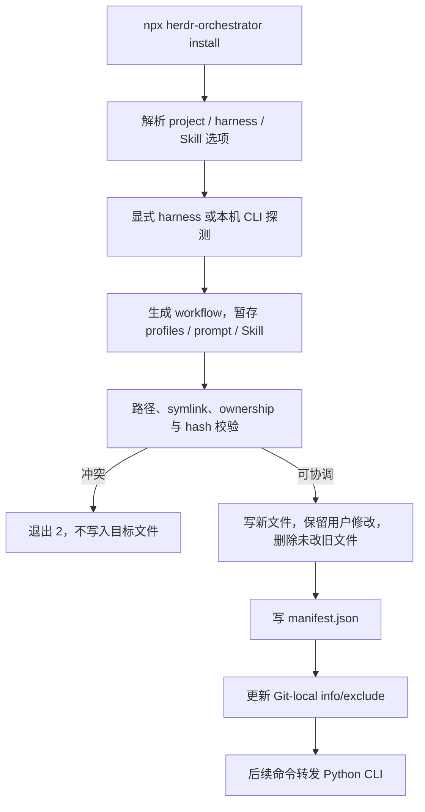
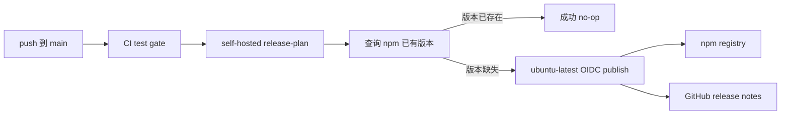

# 安装与分发
Active contributors: oldwinter, chendongdong

Active contributors: oldwinter, chendongdong

## Purpose

Herdr Orchestrator 有两层分发面：`npx skills add` 安装可移植的 agent 操作说明，`npx --yes herdr-orchestrator install` 安装项目本地 workflow、profiles、可选 Skill 和 Python control plane 的运行入口。Node wrapper 通过 ownership manifest 管理自己写入的文件，升级和卸载都保留用户修改。

本页说明实现契约。首次使用步骤见[快速开始](../overview/getting-started.md)，CI 与发布边界见[部署](../deployment.md)，安装器的信任边界见[安全](../security.md)。

## 布局

```text
bin/
└── herdr-orchestrator.mjs       # npm executable、安装器和 runtime wrapper
package.json                     # npm 元数据、打包清单与 Node 版本
pyproject.toml                   # Python 包、CLI 入口与 Python 版本
skills/herdr-orchestrator/
└── SKILL.md                     # 可移植 agent 操作契约
profiles/harnesses/              # npm 包携带的 profile 模板
workflows/prompts/planner.md     # npm 包携带的 planner prompt
scripts/
└── npm-release-plan.mjs         # Registry 版本 gate
.github/workflows/
└── ci.yml                       # 测试、release plan、npm publish
tests/
├── test_distribution.py
├── test_release.py
└── test_skill_package.py
```

安装到目标项目后的托管面是：

```text
<project>/
├── .herdr-orchestrator/
│   ├── manifest.json
│   ├── workflows/
│   │   ├── multi-harness.toml
│   │   └── prompts/planner.md
│   └── profiles/harnesses/<selected>.{toml,md}
├── .agents/skills/herdr-orchestrator/SKILL.md  # 可选
└── .orchestrator/.gitignore
```

## 关键抽象

| 抽象 | 所在文件 | 作用 |
| --- | --- | --- |
| `install()` | `bin/herdr-orchestrator.mjs` | 探测 harness、生成 workflow、协调托管文件并写 manifest。 |
| `loadManifest()` | `bin/herdr-orchestrator.mjs` | 校验 manifest schema、版本、harness 列表、文件哈希和允许路径。 |
| `isManagedPath()` | `bin/herdr-orchestrator.mjs` | 把 manifest ownership 限制在三个项目本地根及 runtime ignore 文件。 |
| `assertNoSymlink()` | `bin/herdr-orchestrator.mjs` | 拒绝托管路径任一层的符号链接。 |
| `installLocalGitExcludes()` | `bin/herdr-orchestrator.mjs` | 在 Git-local `info/exclude` 中维护带边界标记的 ignore block。 |
| `inspectInstallation()` / `doctor()` | `bin/herdr-orchestrator.mjs` | 比对 manifest 哈希和版本，再合并 Python runtime doctor 结果。 |
| `runRuntime()` | `bin/herdr-orchestrator.mjs` | 注入已安装 workflow 路径与包内 `src/` 的 `PYTHONPATH`，转发 Python CLI 命令。 |
| `uninstall()` | `bin/herdr-orchestrator.mjs` | 仅删除仍与 manifest 哈希一致的文件，保留已修改文件。 |
| Release plan | `scripts/npm-release-plan.mjs` | 查询 npm registry，只在当前版本尚不存在时启用发布 job。 |

## How it works



### 1. 两种安装入口

`docs/installation.md` 给出的 Skill-only 命令是：

```bash
npx skills add oldwinter/herdr-orchestrator \
  --skill herdr-orchestrator --agent '*' -y
```

它只复制 `skills/herdr-orchestrator/SKILL.md` 一类 agent 指令，不安装 Python control plane，也不创建 workflow。`tests/test_skill_package.py` 要求可移植 Skill 始终使用 npm runtime，不引用源码 checkout 的 `PYTHONPATH=src` 或仓库内 workflow 路径。

完整 bootstrap 使用：

```bash
npx --yes herdr-orchestrator install --project .
```

`package.json` 要求 Node.js 20 或更高；`pyproject.toml` 要求 Python 3.12 或更高。npm 包没有 runtime npm dependency，Python 项目也没有 runtime Python dependency，但目标机器仍需 Git、Herdr 和至少一个受支持且可用的 harness CLI。

### 2. Harness 与 Skill 选择

`install()` 在 `bin/herdr-orchestrator.mjs` 中支持重复 `--harness`。没有显式列表时，首次安装会对六个稳定名称执行 `<harness> --version`，保留成功的 CLI；升级时若未传新列表，则沿用 manifest 中的 harnesses。空结果返回 `no_harness_detected`，未知名称返回 `unsupported_harness`。

Skill 安装遵循以下顺序：

1. `--install-skill` 或 `--skip-skill` 显式决定；
2. 升级沿用 manifest 的 `install_skill` 或既有托管文件；
3. 首次安装且目标已有 `.agents/skills/` router 时默认跳过；
4. 其他首次安装默认写入项目 Skill。

若目标已有内容相同但不受 manifest 管理的 Skill，安装器复用它但不取得 ownership，也不会把该 Skill 根加入 installer 的 Git exclude。

### 3. 生成项目本地运行面

`renderWorkflow()` 在 `bin/herdr-orchestrator.mjs` 中根据选定 harness 动态生成 worker 表、`planner.worker_harnesses` 和不超过 6 的 `coordinator.max_parallel`。安装器从 npm 包复制对应的 `profiles/harnesses/<name>.toml`、`profiles/harnesses/<name>.md` 和 `workflows/prompts/planner.md`，并写入 `.orchestrator/.gitignore`。

`package.json` 的 `files` 清单包含 Node wrapper、全部 profile、portable Skill、Python 包、Dashboard 静态资源和 planner prompt。Workflow 本身由 wrapper 生成，因此 npm 清单只需要携带 prompt 模板。`tests/test_distribution.py` 会实际 `npm pack`，再从 checkout 外通过该 tarball 执行安装，固定这项可移植性契约。

### 4. Manifest 驱动协调

`.herdr-orchestrator/manifest.json` 保存 schema version、包名、已安装版本、harness 列表、Skill 选择以及每个托管文件的 SHA-256。`loadManifest()` 只接受以下 ownership 范围：

- `.herdr-orchestrator/`
- `.agents/skills/herdr-orchestrator/`
- `.orchestrator/.gitignore`

安装前，`assertNoSymlink()` 检查托管路径每一层；Git exclude 也必须是安全的普通文件。协调规则是：

| 当前状态 | 安装/升级行为 |
| --- | --- |
| 文件不存在 | 写入并记录新 hash |
| 非托管文件与期望内容相同 | 复用但不取得 ownership |
| 非托管文件与期望内容不同 | 在任何目标写入前以 `unmanaged_file_conflict` 停止 |
| 托管文件仍等于旧 hash | 更新到包内期望内容 |
| 托管文件已被用户修改 | 保留内容和旧 hash，结果返回 `ok=false`、退出码 1 |
| 旧托管文件已不再需要且未修改 | 删除 |
| 旧托管文件已不再需要但被修改 | 保留并继续记录旧 hash |

安装器在仓库的 Git-local `info/exclude` 中维护带 `BEGIN/END` 标记的 block，不修改 tracked `.gitignore`。原生 linked worktree 的外部 common Git directory 被允许，但符号链接伪装的 `.git` 或 exclude 会被拒绝。`tests/test_distribution.py` 覆盖了冲突、symlink、linked worktree、用户修改保留和 Git status 不变等行为。

### 5. 诊断、运行与卸载

`doctor()` 先由 `inspectInstallation()` 检查 missing、modified 和 manifest/runtime version skew，再调用包内 Python 模块的 `doctor --workflow <installed-workflow>`。stdout 是一个 JSON 文档，顶层 `ok` 只有在 installation 与 runtime 都健康时才为 true。

除 setup 命令外，`runRuntime()` 把 `.herdr-orchestrator/workflows/multi-harness.toml` 作为 `--workflow` 注入，并将 npm 包的 `src/` 加入子进程 `PYTHONPATH`。wrapper 未消费的参数原样转发给 `src/herdr_orchestrator/cli.py`。

`upgrade` 和 `update` 都复用 `install()` 的协调逻辑。`uninstall()` 只删除仍匹配 manifest hash 的文件，保留用户修改项并以退出码 1 报告；处理后会移除 manifest，因此保留项不再受安装器管理。只有相关托管根都不存在时，安装器才移除 Git exclude block。

### 6. npm 发布



当前 `.github/workflows/ci.yml` 在 `ubuntu-latest` 上运行测试和质量 gate。`main` 测试成功后，带仓库专属标签的 self-hosted runner 执行 `scripts/npm-release-plan.mjs`：它严格校验 `package.json` 的 name/version，查询 `npm view <name> versions --json`，registry 错误会中止，已有版本是成功 no-op。

缺失版本才会启用 GitHub-hosted `publish` job。该 job 使用 npm Trusted Publishing 的 OIDC `id-token: write`，不设置长期 `NODE_AUTH_TOKEN`，执行 `npm publish --access public`，随后为同一版本创建 GitHub release notes。`tests/test_release.py` 固定了 registry failure、版本 gate、runner 类型、OIDC 和 action pinning。

## 集成点

- `skills/herdr-orchestrator/SKILL.md` 把安装、doctor、catalog、enqueue、drain、retry 和 GC 串成 agent 可执行的操作契约。
- `bin/herdr-orchestrator.mjs` 以 `src/herdr_orchestrator/cli.py` 为 Python runtime 入口，并固定目标项目的 workflow 路径。
- 安装时生成的 profile 与 workflow 进入 [Harness catalog 与路由](catalog-and-routing.md)，其 schema 由 `src/herdr_orchestrator/config.py` 校验。
- `.github/workflows/ci.yml` 使用 `package.json` 和 `scripts/npm-release-plan.mjs` 决定是否发布；`package.json` 与 `pyproject.toml` 的版本必须保持一致。
- 权限、symlink、Git-local exclude 和最大自动化启动参数的边界见[安全](../security.md)。

## 修改入口

修改安装、升级、卸载或 runtime 参数转发时，从 `bin/herdr-orchestrator.mjs` 和 `tests/test_distribution.py` 开始，并用真实 tarball 场景验证 checkout 外安装。修改 portable Skill 时同步运行 `tests/test_skill_package.py`；修改打包内容、版本 gate 或发布 runner 时检查 `package.json`、`scripts/npm-release-plan.mjs`、`.github/workflows/ci.yml` 和 `tests/test_release.py`。

发布前同时更新 `package.json` 与 `pyproject.toml` 的版本，运行 `npm run release:plan` 和仓库质量检查。不要把 npm token 加入 workflow，也不要把 OIDC publish 移到 self-hosted runner。

## 关键源文件表

| 文件 | 作用 |
| --- | --- |
| `bin/herdr-orchestrator.mjs` | 安装、升级、doctor、卸载、manifest 与 Python runtime wrapper。 |
| `package.json` | npm executable、Node engine、打包清单和 release script。 |
| `pyproject.toml` | Python 包版本、Python engine 与 `herdr-orchestrator` CLI 入口。 |
| `skills/herdr-orchestrator/SKILL.md` | 面向 agent 的项目 bootstrap 和 queue 操作契约。 |
| `docs/installation.md` | 面向维护者和使用者的安装、诊断及发布说明。 |
| `scripts/npm-release-plan.mjs` | npm registry 版本存在性 gate。 |
| `.github/workflows/ci.yml` | 测试、release plan、Trusted Publishing 和 GitHub release。 |
| `profiles/harnesses/*.toml` | npm 安装器复制的紧凑 profile 元数据。 |
| `profiles/harnesses/*.md` | npm 安装器复制的完整执行 profile。 |
| `workflows/prompts/planner.md` | 安装后 workflow 使用的 planner prompt。 |
| `tests/test_distribution.py` | 安装 ownership、安全路径、升级、卸载和 packed npm 测试。 |
| `tests/test_release.py` | Registry gate 与 CI 发布边界测试。 |
| `tests/test_skill_package.py` | Portable Skill 的 npm runtime 和 CLI 示例测试。 |
