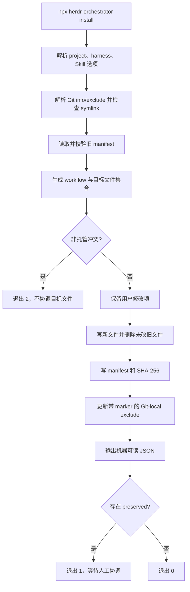
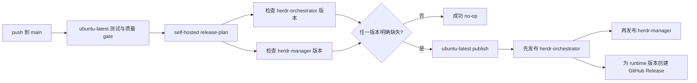

# 安装与分发
Active contributors: oldwinter, chendongdong

## 定位

Herdr Orchestrator 的分发面由三个彼此独立、职责不同的入口组成：

1. `npx skills add` 只安装 agent 操作说明；
2. `npx --yes herdr-orchestrator install` 把 durable control plane 安装到目标 Git 仓库；
3. `npx --yes herdr-manager` 启动一次性的手动 Herdr 管理会话。

主 npm 包中的 `bin/herdr-orchestrator.mjs` 是无运行时 npm 依赖的 installer/runtime
wrapper。它不下载 Python，而是携带 Python 源码、workflow 模板、harness profiles、固定
Manager policy 与 Manager Light 插件，再通过目标机器已有的 Python 3.12+ 执行控制面。

首次使用见[快速开始](../overview/getting-started.md)；交互式入口见
[手动 Manager](manual-manager.md)；sidebar 投影见[Manager Light](manager-light.md)；
发布流水线见[部署、发布与维护](../deployment.md)；信任边界见
[安全与信任边界](../security.md)。

## 仓库布局

```text
bin/herdr-orchestrator.mjs                 # 主 npm executable、安装器、runtime wrapper
package.json                               # herdr-orchestrator 包元数据和打包清单
packages/herdr-manager/
├── package.json                           # 薄 herdr-manager npm 包
└── bin/herdr-manager.mjs                  # 固定 argv 转发到主 runtime
manager/
├── AGENTS.md                              # 手动 Manager canonical policy
└── CLAUDE.md                              # Claude 适配入口，只引用 AGENTS.md
plugins/manager-light/                     # 可选 Herdr sidebar metadata 投影
profiles/harnesses/                        # 六种 harness 的紧凑与完整 profiles
skills/herdr-orchestrator/SKILL.md         # 可移植 agent Skill
workflows/prompts/planner.md               # 安装包携带的 planner prompt
scripts/npm-release-plan.mjs               # npm registry 版本 gate
.github/workflows/ci.yml                   # 测试、双包 release plan、OIDC 发布
tests/test_distribution.py                 # 安装、ownership、Manager 分发契约
tests/test_manager_light.py                # Manager Light 契约
tests/test_release.py                       # 双包 release 与 OIDC 契约
```

安装到目标仓库后，项目本地受管面为：

```text
<project>/
├── .herdr-orchestrator/
│   ├── manifest.json
│   ├── manager/
│   │   ├── AGENTS.md
│   │   └── CLAUDE.md
│   ├── profiles/harnesses/<selected>.{toml,md}
│   └── workflows/
│       ├── multi-harness.toml
│       └── prompts/planner.md
├── .agents/skills/herdr-orchestrator/SKILL.md  # 可选
└── .orchestrator/.gitignore
```

## 关键抽象

| 抽象 | 职责与不变量 |
| --- | --- |
| `install()` | 探测或校验 harness、生成 workflow、协调受管文件、写 manifest，并维护 Git-local exclude。 |
| `loadManifest()` | 校验 schema 1、包名、版本、唯一 harness 列表、Skill 偏好和每个 SHA-256。 |
| `isManagedPath()` | 将 manifest ownership 限制在 `.herdr-orchestrator/`、可选 Skill 根和 `.orchestrator/.gitignore`。 |
| `assertNoSymlink()` | 在读写前逐层 `lstat` 受管路径；任何 symlink 都失败关闭。 |
| `gitExcludePath()` | 通过 `git -C <project> rev-parse --git-path info/exclude` 找到 Git-local exclude。 |
| `inspectInstallation()` / `doctor()` | 检查 missing、modified、version skew，再合并 Python runtime doctor。 |
| `runRuntime()` | 注入已安装 workflow 和包内 `src/` 的 `PYTHONPATH`，其余参数原样转发。 |
| `uninstall()` | 只删除仍匹配 manifest hash 的文件；用户修改项保留。 |
| `packages/herdr-manager/bin/herdr-manager.mjs` | 不使用 shell，只把 argv 转发给主包的 `manager` 子命令。 |
| `scripts/npm-release-plan.mjs` | 分别检查两个 npm 包的当前版本是否已存在，只有明确缺失才发布。 |

## 三条安装路径

### 只安装可移植 Skill

```bash
npx skills add oldwinter/herdr-orchestrator \
  --skill herdr-orchestrator --agent '*' -y
```

该入口只复制 `skills/herdr-orchestrator/SKILL.md`，不创建 workflow、不安装项目 runtime，
也不接管 durable state。使用 `-g` 可安装为用户级 Skill。仓库同时包含 opt-in
standardized-delivery Skills，因此命令必须显式指定 `--skill herdr-orchestrator`。

### 安装项目 runtime

```bash
cd /path/to/target-repository
npx --yes herdr-orchestrator install --project .
npx --yes herdr-orchestrator doctor --project .
```

前置条件是 Node.js 20+、Python 3.12+、Git、Herdr，以及至少一个已安装的 harness CLI。
主 npm 包本身没有 runtime npm dependencies，也不会执行全局安装或要求提权。

首次安装未给 `--harness` 时，wrapper 依次对六个稳定名称运行 `<harness> --version`，
把成功者写入安装：

```text
droid · grok · codex · pi · claude · hermes
```

这只是 executable 探测，不证明认证、模型或 provider 健康。可以显式固定：

```bash
npx --yes herdr-orchestrator install --project . \
  --harness droid \
  --harness codex
```

升级未传 `--harness` 时沿用 manifest 中的列表；显式传入新列表则协调 profiles 与
workflow。无候选时返回 `no_harness_detected`，未知名称返回 `unsupported_harness`。

### 启动一次性 Manager

```bash
npx --yes herdr-manager
npx --yes herdr-manager claude
```

`herdr-manager` 是薄 npm 包，只依赖 `herdr-orchestrator` 并把固定 argv 转发给其 runtime；
它不复制项目文件、不创建 manifest，也不需要 `--project`。默认 harness 顺序严格为
`grok → codex → claude`。完整行为见[手动 Manager](manual-manager.md)。

## 安装控制流



`renderWorkflow()` 根据已选 harness 生成 worker 表、planner 候选池和最多为 6 的
`coordinator.max_parallel`。安装器复制对应的 compact/full profiles、planner prompt、
`manager/AGENTS.md`、`manager/CLAUDE.md`，并写入只忽略 runtime state 的
`.orchestrator/.gitignore`。

## 操作说明选择

项目 Skill 是否由 installer 管理，按以下优先级决定：

1. 显式 `--install-skill` 或 `--skip-skill`；
2. 升级沿用 manifest 的 `install_skill`，旧 manifest 则从受管文件推导；
3. 首次安装且目标已有 `.agents/skills/` router 时默认跳过；
4. 其他首次安装默认安装。

```bash
npx --yes herdr-orchestrator install --project . --install-skill
npx --yes herdr-orchestrator upgrade --project . --skip-skill
```

内容完全相同、但已由 `npx skills` 等外部工具安装的 Skill 会被复用而不被写入 manifest。
因此 installer 不会在升级或卸载时删除它，也不会把其目录加入自己的 Git exclude block。

## 清单所有权

`.herdr-orchestrator/manifest.json` 记录：

- `schema_version = 1`；
- 固定包名 `herdr-orchestrator`；
- 安装时包版本；
- 唯一且受支持的 harness 列表；
- `install_skill` 偏好；
- 每个受管文件的 SHA-256。

Manifest 路径必须是项目相对路径，不能含反斜线、`..` 或受管根之外的条目。协调规则如下：

| 当前状态 | 安装、升级或卸载行为 |
| --- | --- |
| 目标文件不存在 | 写入并记录期望 hash。 |
| 非托管文件内容相同 | 复用，不取得 ownership。 |
| 非托管文件内容不同 | 在目标协调前以 `unmanaged_file_conflict` 退出 2。 |
| 受管文件仍等于旧 hash | 更新到新内容，或在不再需要时删除。 |
| 受管文件已被用户修改 | 保留字节和旧 hash；返回 `preserved`、`ok=false`、退出 1。 |
| 卸载时受管文件未修改 | 删除。 |
| 卸载时受管文件已修改 | 保留；manifest 仍会移除，该文件随后不再受管。 |

`doctor` 会把 manifest 的 missing、modified 和 `version_skew` 与 Python runtime 检查合并：

```bash
npx --yes herdr-orchestrator doctor --project .
```

只有 `installation.ok`、`runtime.ok` 与顶层 `ok` 都为 `true` 才健康。真实 dispatch 还要求
运行于具备正确 `HERDR_*` 环境的 Herdr pane；详见
[Herdr runtime](herdr-runtime.md)。

## Git `info/exclude`

安装器不修改目标仓库已跟踪的 `.gitignore`，而是在 Git-local `info/exclude` 中维护：

```text
# BEGIN herdr-orchestrator managed paths
/.herdr-orchestrator/
/.orchestrator/
/.agents/skills/herdr-orchestrator/   # 仅当 manifest 拥有 Skill
# END herdr-orchestrator managed paths
```

这样生成面不会改变 `git status`，也不会把本地策略强加给其他 clone。实现先用 Git 解析
真实 exclude 路径，再检查：

- 项目内 `.git` 祖先或 exclude 本身若是 symlink，则拒绝写入；
- exclude 已存在时必须是普通文件；
- 原生 linked worktree 指向外部 common Git directory 的路径被允许；
- marker 不完整时拒绝猜测或覆盖；
- 卸载后只有相关受管根均不存在才移除 block。

该设计把“Git 不显示”与“installer 拥有”分开：未被 manifest 接管的 Skill 不会被悄悄隐藏。

## 运行时包装器

安装完成后，wrapper 为 Python CLI 补齐项目 workflow：

```bash
npx --yes herdr-orchestrator catalog --project .
npx --yes herdr-orchestrator status --project .
npx --yes herdr-orchestrator run --project . --once
npx --yes herdr-orchestrator run --project . --until-idle
npx --yes herdr-orchestrator retry --project . --job-id 42
npx --yes herdr-orchestrator resume --project . \
  --job-id 43 --response-file approval.txt
npx --yes herdr-orchestrator gc --project . --succeeded-agents
npx --yes herdr-orchestrator dashboard --project .
```

`runRuntime()` 将
`<project>/.herdr-orchestrator/workflows/multi-harness.toml` 固定为 `--workflow`，把 npm
包内 `src/` 放进子进程 `PYTHONPATH`，并原样转发 wrapper 未消费的参数。Queue、lease、
retry、receipt 与 GC 的语义仍由 Python coordinator 决定，不由 Node wrapper 重写。

## 升级与卸载

```bash
npx --yes herdr-orchestrator upgrade --project .
npx --yes herdr-orchestrator update --project .       # upgrade 的别名
npx --yes herdr-orchestrator uninstall --project .
```

升级是同一套 manifest reconciliation，不是覆盖式复制。显式改变 harness 列表时，未修改且
不再选择的 profiles 会删除，已修改文件会保留。卸载处理所有 manifest 条目后删除 manifest；
返回 `preserved` 的文件由用户继续拥有。

## 双 npm 包发布与 OIDC



`.github/workflows/ci.yml` 对 `package.json` 和
`packages/herdr-manager/package.json` 分别运行 `scripts/npm-release-plan.mjs`：

- registry 已有版本时是成功 no-op；
- 显式 npm `E404` 表示新包或无已发布版本，可以发布；
- 其他 registry、网络或 JSON 错误全部停止，不能猜成“版本缺失”；
- 两个包独立决定是否发布，runtime 包先于依赖它的 Manager 薄包。

真正的 publish 必须留在 GitHub-hosted `ubuntu-latest`，因为 npm Trusted Publishing
不支持 self-hosted runner。Job 绑定 `npm` Environment，授予 `id-token: write` 取得 OIDC，
并用 `npm publish --access public` 发布；不设置 `NODE_AUTH_TOKEN` 或长期 npm token。
仓库为私有仓库，因此当前流程不传 `--provenance`。`contents: write` 只用于 runtime 新版本
发布后创建 GitHub Release。

版本是不可变的：只改包内容而不提升对应 `package.json` 版本不会产生新发布。Manager 薄包
发生变化时还必须独立提升 `packages/herdr-manager/package.json` 的版本，并保持其
`herdr-orchestrator` 依赖范围兼容。

## 集成点

- [Harness catalog 与路由](catalog-and-routing.md)消费安装器生成的 workflow 与 selected
  profiles。
- [Herdr runtime](herdr-runtime.md)消费 Node wrapper 转发的 Python CLI 调用与项目运行环境。
- [手动 Manager](manual-manager.md)复用主 npm 包中的固定 policy，不共享 durable queue 状态。
- [Manager Light](manager-light.md)随主 npm 包分发，但只有显式 `manager-light install`
  才修改 Herdr 配置。
- [安全与信任边界](../security.md)定义 symlink、manifest、最大自动化和 npm OIDC 的授权边界。

## 修改入口

| 修改目标 | 首要入口 | 必须同步验证 |
| --- | --- | --- |
| 安装、升级、卸载、manifest、Git exclude | `bin/herdr-orchestrator.mjs` | `tests/test_distribution.py` |
| 主 npm 包名、bin、Node 版本或打包内容 | `package.json` | 真实 `npm pack --dry-run --json` 与 packed tarball 测试 |
| `npx herdr-manager` 转发或依赖 | `packages/herdr-manager/bin/herdr-manager.mjs`、`packages/herdr-manager/package.json` | `tests/test_distribution.py` |
| Manager policy 被安装的内容 | `manager/AGENTS.md`、`manager/CLAUDE.md` | 源码、packed 主包和项目安装三种入口 |
| Manager Light 打包与安装 | `plugins/manager-light/` | `tests/test_manager_light.py`、`tests/test_distribution.py` |
| Registry gate 或 OIDC 发布 | `scripts/npm-release-plan.mjs`、`.github/workflows/ci.yml` | `tests/test_release.py` |

收口前运行：

```bash
PYTHONPATH=src python3 -m unittest -v \
  tests.test_distribution tests.test_manager_light tests.test_release
npm pack --dry-run --json
npm pack --dry-run --json ./packages/herdr-manager
just check
```

## 关键源文件

| 完整路径 | 作用 |
| --- | --- |
| `bin/herdr-orchestrator.mjs` | 无 npm runtime dependency 的 installer/runtime wrapper、Manager launcher 与 Manager Light CLI。 |
| `package.json` | `herdr-orchestrator` 的 bin、Node engine、打包清单与公开发布配置。 |
| `packages/herdr-manager/package.json` | 薄 Manager 包的独立版本、bin 和主 runtime 依赖。 |
| `packages/herdr-manager/bin/herdr-manager.mjs` | 通过 Node argv 无 shell 转发到主包 `manager` 子命令。 |
| `manager/AGENTS.md` | 手动 Manager canonical policy。 |
| `manager/CLAUDE.md` | Claude 兼容入口，只要求读取 canonical policy。 |
| `plugins/manager-light/configure.mjs` | Herdr 插件与受管 sidebar block 的安装、状态、卸载事务。 |
| `skills/herdr-orchestrator/SKILL.md` | 独立 Skill 分发入口。 |
| `scripts/npm-release-plan.mjs` | npm registry 版本存在性 gate。 |
| `.github/workflows/ci.yml` | 测试、双包计划、GitHub-hosted OIDC 发布与 Release。 |
| `docs/installation.md` | 面向维护者的 canonical 安装和发布契约。 |
| `tests/test_distribution.py` | 安装 ownership、Git exclude、Manager launcher 与 packed npm 行为。 |
| `tests/test_manager_light.py` | 插件配置事务和 metadata 投影行为。 |
| `tests/test_release.py` | 双包版本 gate、runner、OIDC、token absence 和 action pinning。 |
