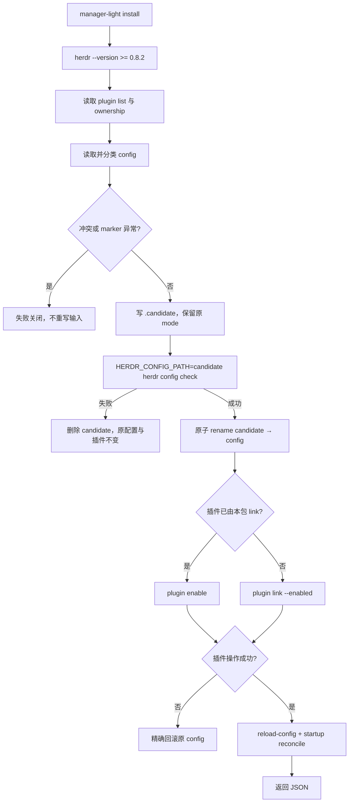
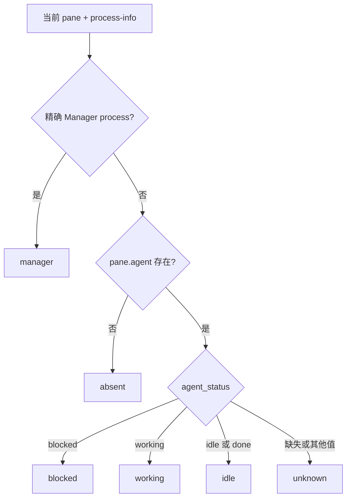

# Manager Light 侧栏投影
Active contributors: oldwinter, chendongdong

## 定位

Manager Light 是随 `herdr-orchestrator` npm 包分发的可选 Herdr 插件。它只做两件事：

1. 在一个带 ownership marker 的 `[ui.sidebar.agents]` block 中定义 Agent sidebar rows；
2. 把 Herdr 当前 pane/process 事实投影为一组互斥 metadata tokens。

它不启动 Manager，不选择 harness，不创建 queue，不轮询 durable state，也不修改
`agent_status` 或任何生命周期。蓝色实心灯表示当前 pane 中存在经过精确 argv 识别的 Manager；
其他颜色只是 Herdr 已有 blocked、working、idle/done 或 unknown 状态的显示投影。

Manager launcher 见[手动 Manager](manual-manager.md)，npm 安装面见
[安装与分发](installation-and-distribution.md)，原始 agent lifecycle 见
[Herdr runtime](herdr-runtime.md)。

## 仓库布局

```text
plugins/manager-light/
├── herdr-plugin.toml                     # 插件 manifest、版本与事件路由
├── configure.mjs                         # install/status/uninstall 与配置事务
├── hook.mjs                              # startup/event reconciliation
└── projection.mjs                        # pane classification 与 token patch
bin/herdr-orchestrator.mjs                # manager-light CLI 与 Manager metadata 上报
package.json                              # 将整个插件目录打入主 npm 包
tests/test_manager_light.py               # 配置、hook、projection 行为契约
tests/test_distribution.py                # packed package 与 launcher 集成契约
```

## 关键抽象

| 抽象 | 职责与不变量 |
| --- | --- |
| `herdr-plugin.toml` | 声明插件 ID、Herdr 最低版本、startup/action/lifecycle event。 |
| `MANAGED_CONFIG_BLOCK` | 唯一允许写入的 sidebar block，内容和 marker 必须逐字匹配。 |
| `inspectConfigText()` | 将配置分类为 `absent`、`owned`、`conflict` 或 `malformed`。 |
| `prepareCandidate()` | 写同目录候选文件、保留 mode、用 `herdr config check` 校验。 |
| `installManagerLight()` | 先原子提交合法配置，再 link/enable 插件；插件失败时精确回滚配置。 |
| `uninstallManagerLight()` | 先准备合法移除候选，unlink 成功后才原子提交。 |
| `classifyPane()` | 以精确 Manager process 优先，否则投影 Herdr `agent_status`。 |
| `tokenPatchFor()` | 每次都拥有并设置/清除完整六 token family，保证互斥。 |
| `reconcileStartup()` / `reconcileEvent()` | startup 全量协调；event 只作触发器，始终重读当前 pane。 |

## 安装、状态与卸载

高频 Manager 安装入口会显式启用插件：

```bash
just install-manager
```

其效果是先安装全局 CLI，再执行：

```bash
herdr-orchestrator manager-light install
```

也可以独立检查或移除：

```bash
herdr-orchestrator manager-light status
herdr-orchestrator manager-light uninstall
```

单独执行 `npm install --global herdr-orchestrator` **不会**修改 Herdr 配置。Manager Light
始终是显式 opt-in。CLI 输出单个 JSON 文档；`status.ok` 只有在配置 block 为 owned、插件
已启用且 plugin root 属于当前包时才为 true。

### 前置条件

- Herdr 0.8.2 或更高；
- Node.js 可执行 `hook.mjs`；
- 可写的 Herdr config；
- 插件 ID `herdr-manager-light` 未被其他路径占用。

Herdr config 路径按以下顺序解析：

1. `HERDR_CONFIG_PATH`；
2. Windows 的 `%APPDATA%/herdr/config.toml`；
3. `$XDG_CONFIG_HOME/herdr/config.toml`；
4. `$HOME/.config/herdr/config.toml`。

现有 config 若是 symlink 会以 `manager_light_config_path_is_symlink` 失败关闭。

## 受管配置 block

插件只拥有下面两个 marker 之间的完整字节：

```toml
# BEGIN herdr-manager-light managed ui.sidebar.agents
[ui.sidebar.agents]
rows = [
  [
    { token = "$hml_manager", fg = "#66B8FF" },
    { token = "$hml_blocked", fg = "#F7768E" },
    { token = "$hml_working", fg = "#E0AF68" },
    { token = "$hml_idle", fg = "#9ECE6A" },
    { token = "$hml_unknown", fg = "#7DCFFF" },
    "workspace",
    "tab",
  ],
  ["agent"],
]
# END herdr-manager-light managed ui.sidebar.agents
```

Block 之外的配置字节在 install/uninstall 往返后保持不变，包括文件原本是否以换行结束。
实现故意不配置 `state_icon`。自定义 rows 只影响桌面端展开的 Agent sidebar；折叠 sidebar
和移动端继续使用 Herdr 内建 indicator。

`inspectConfigText()` 在以下情况拒绝修改：

- 起止 marker 数量不一致、重复或顺序错误；
- marker 内 block 已被人工修改；
- block 外存在任何 `[ui.sidebar.agents]`、其子表、dotted key、inline table，或
  `[ui.sidebar]` 中的 `agents = ...`；
- 已有同 ID 插件来自另一个 canonical plugin root。

因此工具不会合并或覆盖外部 Agent rows；使用者必须先决定由谁拥有该配置面。

## 原子配置事务



候选文件和最终 config 位于同一目录，`rename` 提供原子替换。候选文件使用 `wx`，并继承
原 config mode；新配置默认 mode 为 `0600`。`herdr config check` 校验的是通过临时
`HERDR_CONFIG_PATH` 指向的候选，而不是先污染真实配置再检查。

插件 link 失败时：

- 原 config 存在：通过独立 rollback 文件原子恢复原始字节；
- 原 config 不存在：删除本次创建的 config；
- 不留下 `.candidate`。

卸载采用相反但同样保守的顺序：先生成并校验“移除 owned block 后”的候选，随后 unlink
本包拥有的插件，只有 unlink 成功才提交候选。重复 install/uninstall 是幂等的。

## 插件 manifest 与触发器

`plugins/manager-light/herdr-plugin.toml` 声明：

```text
id: herdr-manager-light
minimum Herdr: 0.8.2
platforms: linux, macos, windows
startup: node hook.mjs
manual action: refresh
events:
  pane.created
  pane.moved
  pane.agent_detected
  pane.agent_status_changed
```

所有触发器都进入同一个 `hook.mjs`，避免 lifecycle 分支各自维护不同投影逻辑。

### 启动时协调

Startup 调用 `herdr pane list`，只处理：

- `pane.agent` 存在的普通 Agent pane；
- 已带 `hml_role=manager` marker、需要验证或清理的 pane。

每个候选 pane 都重新调用 `herdr pane process-info --pane <id>`，根据当前事实计算完整 patch，
然后用 `pane report-metadata` 写回。

### 事件协调

Event payload 只用于提取 `pane_id`，不能作为 lifecycle 真源。Hook 随后调用：

```text
herdr pane get <pane-id>
herdr pane process-info --pane <pane-id>
herdr pane report-metadata <pane-id> ...
```

因此即使 event payload 中写着 `working`，若当前 pane 已变成 `blocked`，最终也投影 blocked。
JSON 异常、缺 pane ID、读取失败或 metadata 写入失败会让 hook 失败，而不是使用陈旧 payload
猜测。

## 窗格分类



Manager 识别要求 foreground process argv 匹配以下真实形状之一：

- executable 名精确为 `herdr-manager`；
- `node .../herdr-manager`；
- `herdr-orchestrator manager`；
- `node .../herdr-orchestrator.mjs manager`。

只出现相似 `cmdline` 文本、`my-herdr-manager`、错误子命令或颠倒参数均不匹配。Process 证据
优先于 agent lifecycle，因此 Manager pane 即使被 Herdr 识别为普通 agent 也显示蓝色
Manager token。Launcher 自己也会 best-effort 设置 `hml_role=manager`；startup reconciliation
仍通过 process argv 验证，进程消失后可清除陈旧 marker。

## 元数据令牌族

每次 patch 都同时拥有以下六个 token，先全部置空，再只填当前 classification 对应值：

| Classification | Role token | 可见 token | 字形 | 配置颜色 |
| --- | --- | --- | --- | --- |
| `manager` | `hml_role=manager` | `hml_manager` | `●` | `#66B8FF` 蓝 |
| `blocked` | 清除 | `hml_blocked` | `●` | `#F7768E` 红 |
| `working` | 清除 | `hml_working` | `●` | `#E0AF68` 黄 |
| `idle` | 清除 | `hml_idle` | `○` | `#9ECE6A` 绿 |
| `unknown` | 清除 | `hml_unknown` | `○` | `#7DCFFF` 青 |
| `absent` | 清除 | 全部清除 | 无 | 无 |

Metadata source 固定为 `herdr-manager-light`。完整 patch 防止 pane 从 working 变 idle 后仍残留
两个颜色，也防止 Manager 退出后 `hml_role` 继续误导 sidebar。

这里没有任何 `agent start`、`prompt`、`wait`、`send-keys` 或 state update。插件读取 Herdr
事实后只调用 `pane report-metadata`，所以“灯的颜色”不能成为任务收据，也不能把
idle/done 提升为成功。

## 状态与失败边界

| 状态或错误 | 含义 |
| --- | --- |
| `status.ok=false` | Config block、插件 enabled 状态或 plugin-root ownership 至少一项不匹配。 |
| `manager_light_requires_herdr_0_8_2` | Herdr 版本低于最低要求。 |
| `manager_light_config_markers_malformed` | Marker 缺失、重复或不成对。 |
| `manager_light_config_block_modified` | Owned marker 内字节不再等于 canonical block。 |
| `manager_light_agent_rows_owned_externally` | 外部配置已占用 Agent rows。 |
| `manager_light_config_candidate_invalid` | `herdr config check` 拒绝候选；真实 config 未被替换。 |
| `manager_light_plugin_owned_externally` | 同 ID 插件指向其他 root，不能接管或 unlink。 |
| `manager_light_plugin_link_failed` | Link 失败；install 回滚原配置。 |
| `manager_light_plugin_unlink_failed` | Unlink 失败；uninstall 不提交移除候选。 |

Manager launcher 对 metadata 的单次上报是 best-effort；插件 hook 的失败也不改 durable queue
状态。显示异常应先运行 `manager-light status`，再核对 Herdr 当前 pane/process，而不是从颜色
反推任务成功。

## 集成点

- [手动 Manager](manual-manager.md)在进程前后 best-effort 设置和清除同一 token family。
- [安装与分发](installation-and-distribution.md)把插件目录打入主 npm 包，但不自动启用。
- [Herdr runtime](herdr-runtime.md)提供被投影的 agent lifecycle；Manager Light 不拥有该状态。
- [Dashboard](dashboard.md)是 durable queue 与 topology 的只读 Web 投影，与 sidebar 插件是
  两个独立观察面。
- [安全与信任边界](../security.md)定义 config symlink、插件 ownership、terminal/process
  观察和成功证据边界。

## 修改入口

| 修改目标 | 首要入口 | 必须同步验证 |
| --- | --- | --- |
| Herdr 最低版本、平台或事件集合 | `plugins/manager-light/herdr-plugin.toml` | `tests/test_manager_light.py` manifest 测试 |
| Marker、rows、颜色或配置冲突规则 | `plugins/manager-light/configure.mjs` | 往返字节、外部 rows、modified marker、candidate validation |
| Manager argv 识别、lifecycle 映射或 token | `plugins/manager-light/projection.mjs` | classification totality、拒绝近似 argv、互斥完整 patch |
| Startup/event 读取顺序与 metadata 写入 | `plugins/manager-light/hook.mjs` | 事件 payload 仅触发、当前 pane 重读、failure 路径 |
| CLI install/status/uninstall 路由 | `bin/herdr-orchestrator.mjs` | `tests/test_manager_light.py` CLI 集成 |
| npm 打包或 Manager 联动 | `package.json`、`bin/herdr-orchestrator.mjs` | `tests/test_distribution.py` packed tarball 与 launcher metadata |

最小回归：

```bash
PYTHONPATH=src python3 -m unittest -v \
  tests.test_manager_light tests.test_distribution
npm pack --dry-run --json
just check
```

## 关键源文件

| 完整路径 | 作用 |
| --- | --- |
| `plugins/manager-light/herdr-plugin.toml` | 插件 ID、版本、平台、startup/action/event manifest。 |
| `plugins/manager-light/configure.mjs` | Config ownership、候选校验、原子安装/卸载、plugin root ownership。 |
| `plugins/manager-light/hook.mjs` | Startup 全量与 event 当前态 reconciliation。 |
| `plugins/manager-light/projection.mjs` | 精确 Manager process 识别、lifecycle classification 与 token family。 |
| `bin/herdr-orchestrator.mjs` | `manager-light` CLI 路由及 launcher 的 best-effort metadata。 |
| `package.json` | 主 npm 包中的 `plugins/manager-light/` 打包清单。 |
| `tests/test_manager_light.py` | Projection、hook、config transaction 和 Herdr 0.8.2 形状契约。 |
| `tests/test_distribution.py` | Packed npm 插件文件、Manager token 上报与 `just install-manager` 集成。 |
| `docs/installation.md` | Manager Light 安装、ownership、桌面 sidebar 与发布说明。 |
