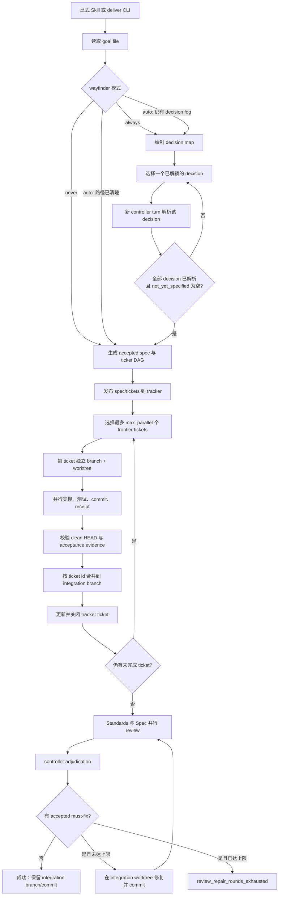
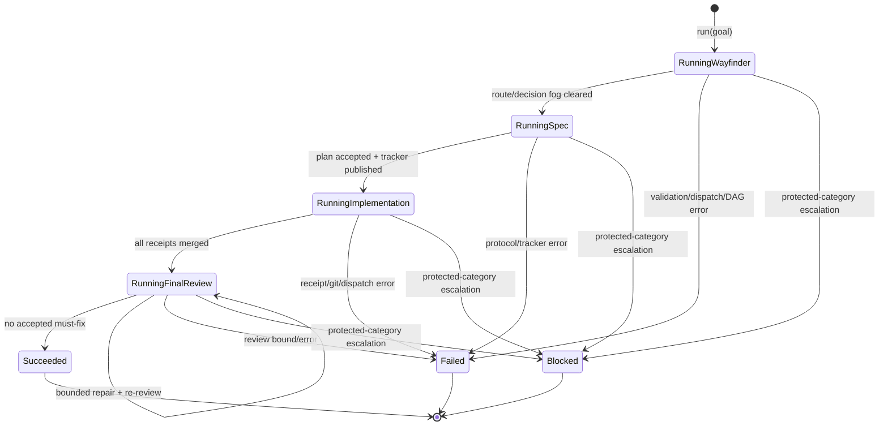

# 标准化交付
Active contributors: oldwinter, chendongdong

Active contributors: oldwinter, chendongdong

标准化交付是与普通 durable queue 分离的、显式选择（opt-in）的工程交付面。它把“目标澄清 → 接受的规格 → ticket DAG → 隔离实现 → 集成 → 独立双轴审查 → 有界修复”交给确定性 coordinator 推进；controller 和 worker 只能生成经严格校验的 JSON artifact，不能自行宣布阶段成功。成功结果停在隔离的 integration branch，不会 push、合并到用户分支或部署。

相关背景见[交付 Artifact 原语](../primitives/delivery-artifacts.md)、[安全边界](../security.md)和[设计决策](../background/design-decisions.md)。

## Opt-in gate

普通的实现、修复、规划、review 或 orchestrate 请求不会进入此流程。只有以下入口构成显式授权：

- 调用 `standardized-delivery`、`matt-workflow` 或 `wayfinder-delivery` Skill；
- 明确请求 Skill frontmatter 列出的关键词流程：“标准化交付”“完整工程流程”“Matt workflow”“Pocock workflow”“Wayfinder 全流程”或“自主交付”；
- 直接调用 `deliver` CLI。

Skill 会先确认触发条件，把不含 secret 的目标写入被忽略的 `.orchestrator/requests/*.md`，确认 `HERDR_ENV=1` 并运行 doctor，然后执行：

```bash
PYTHONPATH=src python3 -m herdr_orchestrator deliver \
  --workflow workflows/multi-harness.toml \
  --goal-file .orchestrator/requests/goal.md
```

CLI 可显式覆盖 tracker、Wayfinder、controller/worker、并发数和修复轮数；否则使用 TOML 默认值。这个 gate 很重要：标准化交付包含本地 principal-proxy 权限和 tracker 写操作，不能从普通请求中推断授权。

## 端到端流程



确定性 coordinator 拥有阶段转换、DAG frontier、并发上限、artifact 校验、Git 集成、重试边界和最终状态。Agent 的普通文本回复不会推进流程；必需 artifact 缺失时会在同一个 ready agent 上重试一次，第二次仍缺失则失败。

## Wayfinder：只消除规格前的决策迷雾

`wayfinder` 支持 `auto`、`always` 和 `never`。默认 `auto` 只有在工作超过一个上下文且仍有阻碍完整规格的决策问题时才进入 Wayfinder；规模大本身不构成理由。

Wayfinder 先生成 `wayfinder-map.json`。每个 `DecisionTicket` 有两到三位数字 ID、`research|prototype|grilling|task` 类型、依赖和 resolution。Coordinator 每次只选择第一个 blockers 已解析的 frontier decision，并用一个新的 controller turn 生成 `wayfinder/resolution-<id>.json`；resolution 可以追加 ID 未使用且依赖已存在的新 decision。上限是 100 次解析，依赖 frontier 停滞会 fail closed。

Wayfinder 只规划，不实现目标。只有全部 decision 都有 resolution 且 `not_yet_specified` 为空，流程才能进入 specification；否则报 `wayfinder_fog_remaining`。`out_of_scope` 则随 decision map 进入后续规划上下文。

## Accepted spec 与 ticket DAG

Controller 把目标和已解析 decision 合成为唯一的 `delivery-plan.json`。`DeliveryPlan` 包含问题、方案、用户故事、实现与测试决策、范围外事项、可观察测试 seams，以及依赖有序的 `DeliveryTicket` 列表。

协议要求：

- slug 是受限的 lowercase kebab-case；
- ticket ID 是两到三位数字且唯一；
- blocker 必须在被依赖 ticket 之前出现，未知或后置依赖直接拒绝；
- 每个 ticket 都是一个可在新上下文中完成的 tracer-bullet 垂直切片；
- 每个 ticket 至少有一个可观察的 acceptance criterion；
- 宽泛机械重构应拆成 expand、有限 migrate batches、contract，而不是按技术层横切；
- plan 不携带 shell 命令或预定文件路径，worker 选择仍由受限 catalog router 完成。

Coordinator 用 `blocked_by ⊆ completed` 计算 frontier；没有 frontier 但仍有未完成 ticket 时返回 `ticket_dag_stalled`。每波最多并行 `max_parallel` 个 ticket，配置与 CLI 都把该值限制在 `1..3`。

## 独立 worktrees、receipt 与 integration

`GitWorkspace` 以启动时仓库 `HEAD` 作为 `base_commit`，创建：

- `ho/<slug>/integration`：隔离 integration branch；
- `ho/<slug>/ticket-<id>`：每个 ticket 的独立 branch；
- `<artifact_root>/<run-id>/worktrees/integration` 与 `ticket-<id>`：对应 checkout。

每一波 ticket 都从当前 integration `HEAD` 创建，因此已完成依赖会进入下一波；同一波 ticket 不共享 working directory、index、branch 或 HEAD。Worker 获得所选 harness 的完整 profile、accepted plan 和单个 ticket，在预先约定的 seam 上实施 TDD，运行窄检查和最终完整校验，然后提交。流程禁止 `git stash`、push、PR、部署和递归调用 review。

实现成功必须同时满足：

1. ticket worktree 是 clean 的，且 `HEAD` 不等于该 worktree 的 base commit；
2. `receipts/ticket-<id>.json` 的 ticket ID 与当前 ticket 一致；
3. receipt 中 acceptance criteria 与 plan 逐字、按顺序一一对应，全部 `passed=true` 且带 evidence；
4. `checks` 非空；
5. receipt commit 是合法 SHA，且与 worktree 当前 `HEAD` 完全一致。

校验后 coordinator 按 ticket ID 稳定排序，用 `--no-ff` 把每个 ticket branch 合并进 integration branch，再用 receipt 更新并关闭 tracker ticket。冲突不会被模型自动掩盖，而是以 `ticket_merge_failed` 终止并保留现场。最终成功值由 `DeliveryResult` 返回：run ID、artifact root、tracker references、integration branch/commit、完成 ticket 数和 review 轮数。

## Standards / Spec review 与 controller adjudication

全部 ticket 集成后才进入 review。两个 fresh agent 在 integration worktree 上并行审查原始 `base_commit...HEAD`：

| 轴 | 证据要求 | 关注点 |
| --- | --- | --- |
| Standards | 仓库规则引用，或命名 smell 加被引用 hunk | 文档化约定以及重复代码、Feature Envy、Shotgun Surgery 等 Fowler heuristics |
| Spec | 被引用的 accepted spec 文本及代码位置 | 缺失/部分实现、越界范围、与规格矛盾的行为 |

Review prompt 明确禁止委派、递归 review 或再生成 review agent。两个轴只提交候选 finding；它们不是最终裁决。Controller 必须根据引用证据把每个 finding 恰好归入 `accepted` 或 `dismissed`，遗漏、重叠或未知 ID 都会被协议拒绝。

只有 accepted 且 severity 为 `must-fix` 的 finding 进入 repair；accepted advisory 不阻塞交付。Repair 在 integration worktree 中验证 citation、修改、测试并 commit，然后两个轴重新运行。默认 `review_repair_rounds=2`，允许值是 `0..2`；最多执行两次 repair，不存在“review 到模型终于说 clean”的无界循环。达到上限后仍有 accepted must-fix 会返回 `review_repair_rounds_exhausted`。

## Principal proxy 与权限边界

显式进入此模式后，controller 可代表用户处理 accepted delivery 内的阻塞问题：

| 权限类别 | 可执行动作 |
| --- | --- |
| `local-reversible` | 回答或批准本地、可逆的实现和测试选择 |
| `spec-authorized` | 回答或批准规格已授权的 repo edit、隔离 commit/integration merge、tracker reconcile 和 repair |
| 超出 accepted spec | 自主 deny，不能扩大目标 |
| `secret` / `production` | 必须 escalate，不能回答或批准 |

每个 blocked turn 最多代理响应 8 次。Controller 读取 worker 的末尾输出后，先对 API key、credential、password、secret、token、production/prod 等敏感词 fail closed；非敏感问题才生成严格的 `ProxyDecision`。Ledger 记录 worker 名、question hash、action、category 和 rationale，不记录给 worker 的具体 answer。Controller 自身 blocked、达到八轮上限、敏感内容或决策为 escalate 都会停止交付。

Tracker 文本、terminal output 和 worker output 都是不可信数据，不能扩大 principal-proxy authority。Worktree 只是 checkout 隔离，不是安全沙箱；运行时和 harness 的更严格安全确认仍然有效。Secret、凭据、token、生产系统、生产数据和部署决策必须交还用户，且不得写进 goal、artifact、ledger、源树或回复。完整边界见[安全](../security.md)。

## Tracker 后端

`tracker_from_config()` 根据 `StandardizedDeliveryConfig` 创建后端。

### Local Markdown（默认）

```text
<tracker_root>/<slug>/
├── spec.md
└── issues/
    ├── 01-<title>.md
    └── 02-<title>.md
```

`publish()` 写入 spec 和每 ticket 文件；关闭时把状态改为 `completed`、勾选 criteria，并附 commit、checks 和 summary。已有内容完全匹配时可幂等复用；若 spec、ready ticket 或已完成 ticket 与预期内容冲突，则报 `tracker_artifact_conflict`，不会覆盖人工或并发修改。

### GitHub Issues

```toml
[standardized_delivery]
tracker_backend = "github"
github_repository = "owner/repo"
```

显式运行只授权通过 `gh` 创建一个 spec issue、按 DAG 顺序创建引用 parent/blocker 的 ticket issues，以及在成功后更新并关闭这些 ticket。它不授权 Git push、PR、远端 branch merge、release 或 deploy。仓库名、命令超时和 issue URL 都会校验；未配置 `github_repository` 时 fail closed。

## Artifact 目录与恢复

Run ID 由 workflow、workspace、goal 文本、tracker/Wayfinder/并发/review 配置及 controller/worker 选择确定性哈希得到。同一输入会定位到同一个 `<artifact_root>/<run-id>/`：

```text
.orchestrator/deliveries/<run-id>/
├── state.json
├── result.json                       # 仅成功完成后写入
├── decision-ledger.jsonl
├── delivery-plan.json
├── wayfinder-route.json              # auto 模式
├── wayfinder-map.json                # 使用 Wayfinder 时
├── wayfinder/
│   └── resolution-<decision-id>.json
├── routes/
│   └── <route-digest>.json
├── proxy/
│   └── <agent>-<round>.json
├── receipts/
│   └── ticket-<ticket-id>.json
├── reviews/
│   └── round-<n>/
│       ├── standards.json
│       ├── spec.json
│       └── verdict.json
└── worktrees/
    ├── integration/
    └── ticket-<ticket-id>/
```

Artifact 都通过[交付 Artifact 原语](../primitives/delivery-artifacts.md)中的精确 shape 校验。已有 plan、route、receipt 和 worktree 只会在仍然匹配时复用；receipt 恢复时还会再次校验 clean commit 与 SHA。完整且合法的 `result.json` 会让重复调用直接返回原 `DeliveryResult`，不再次 dispatch。失败或升级不会清理 worktree；重试前应先检查 `state.json` 与 `decision-ledger.jsonl`，不得通过删除或 force-reset 现场来强行通过。



`state.json` 在运行时记录 `wayfinder`、`spec-and-tickets`、`implementation`、`final-review` 阶段；成功写为 `status=succeeded, stage=complete`，principal-proxy 升级写为 `blocked/stopped`，其他异常写为 `failed/stopped`。

## 退出码

| 退出码 | 含义 | 操作 |
| --- | --- | --- |
| `0` | 所有 ticket receipt 已验证并关闭，integration 已完成，最终双轴 gate 通过 | 报告 integration branch/commit、ticket references、review rounds 和 artifact root |
| `2` | 配置、artifact、dispatch、Git、tracker、DAG、receipt 或 review 失败 | 报告稳定错误和 stopped stage；不能把部分工作声称为成功 |
| `3` | Principal proxy 因 secret/production 等受保护类别升级 | 报告升级类别和 artifact root，等待用户决定 |

常见稳定错误包括 `wayfinder_fog_remaining`、`ticket_dag_stalled`、`ticket_receipt_*`、`ticket_merge_failed`、`review_repair_rounds_exhausted` 和 `principal_proxy_*`。

## 关键抽象

| 抽象 | 位置 | 职责与不变量 |
| --- | --- | --- |
| `StandardizedDelivery` | `delivery.py` | 顶层确定性阶段机；计算 run ID、复用 artifact、推进 Wayfinder、DAG、集成和 review |
| `DeliveryDispatcher` | `delivery.py` | `dispatch/read_agent/respond` 边界；生产实现按 workspace 复用 `HerdrTransport` |
| `DeliveryPlan` / `DeliveryTicket` | `delivery_protocol.py` | Accepted spec 与依赖有序 tracer-bullet DAG |
| `TicketReceipt` | `delivery_protocol.py` | Commit、逐 criterion evidence、checks 和 summary 的完成证明 |
| `ReviewFinding` / `ReviewVerdict` | `delivery_protocol.py` | 双轴候选 finding 与 controller 的完整 adjudication |
| `ProxyDecision` | `delivery_protocol.py` | Principal proxy 的 action、authority category、response 和 rationale |
| `GitWorkspace` / `Worktree` | `git_workspace.py` | branch/worktree 创建、clean commit 校验、`--no-ff` integration merge |
| `DeliveryTracker` | `tracker.py` | 发布 plan/tickets，并仅凭已验证 receipt 关闭 ticket |
| `DeliveryResult` | `delivery.py` | 成功终态及可恢复 `result.json` 的内存表示 |

## 集成点

| 集成面 | 行为 |
| --- | --- |
| CLI | `cli.py` 注册 `deliver`、解析有界 override，并把升级映射到 `3`、预期失败映射到 `2` |
| Workflow config | `config.py` 读取 `[standardized_delivery]`；artifact root 必须位于 workspace 的 `.orchestrator` runtime |
| Harness selection | `selection.py` 选择 controller；`planner.py` 只允许 compact catalog 中启用的 worker |
| Prompt/profile | `catalog.py` 在 dispatch 前注入所选 worker 的完整 profile；`delivery_prompts.py` 固定角色权限与 artifact schema |
| Herdr runtime | `HerdrDeliveryDispatcher` 通过 `HerdrTransport` 启动/复用 agent，并对所有等待使用 coordinator timeout |
| Git | `git_workspace.py` 只调用参数化 argv 的本地 `git`，不会执行模型生成的 shell 字符串 |
| Tracker | `tracker.py` 提供 local Markdown 和受限 GitHub Issues 写入 |
| Tests | 协议、并行 frontier、proxy、Wayfinder、恢复、tracker 冲突和 CLI 退出码分别有行为测试 |

## 修改入口

- **改阶段顺序、并发波次、恢复或 review/repair 语义**：从 `StandardizedDelivery` 入手，同时更新 `tests/test_delivery.py` 和运行文档。
- **改 JSON artifact 字段或约束**：先改 `delivery_protocol.py` 的 dataclass 与 loader，再同步 `delivery_prompts.py` 的 exact schema、tracker renderer 和 `tests/test_delivery_protocol.py`；必须保持已有 artifact 的兼容性或提供明确迁移。
- **改 branch/worktree 命名、commit 或 merge 校验**：修改 `git_workspace.py`，并补充 dirty tree、缺 commit、branch/path conflict 和 merge failure 测试。
- **改 tracker 行为**：修改 `DeliveryTracker` 实现和 `tests/test_tracker.py`；GitHub 权限不得顺带扩大到 PR、push、release 或 deploy。
- **改默认值或 CLI override**：同步 `model.py`、`config.py`、`cli.py`、`workflows/multi-harness.toml`、schema 文档及 config/CLI 测试。
- **改 opt-in 触发或 principal-proxy authority**：以 `.agents/skills/standardized-delivery/SKILL.md` 及 `references/` 为真源，并同步 Skill package 测试；不得让普通编码请求隐式触发。

## 关键源文件

| 文件 | 作用 |
| --- | --- |
| `src/herdr_orchestrator/delivery.py` | 标准化交付 coordinator、阶段机、恢复、路由、proxy、review 与 ledger |
| `src/herdr_orchestrator/delivery_protocol.py` | 所有交付 artifact 的不可变类型与 fail-closed loader |
| `src/herdr_orchestrator/delivery_prompts.py` | Wayfinder、plan、implementation、review、repair 和 proxy prompt 契约 |
| `src/herdr_orchestrator/git_workspace.py` | 隔离 branch/worktree、clean commit 与 integration merge |
| `src/herdr_orchestrator/tracker.py` | Local Markdown / GitHub Issues 发布、reconcile 和关闭 |
| `src/herdr_orchestrator/cli.py` | `deliver` 参数、结果 JSON 与退出码 |
| `src/herdr_orchestrator/config.py` | `[standardized_delivery]` 默认值、范围和路径约束 |
| `src/herdr_orchestrator/model.py` | `StandardizedDeliveryConfig`、tracker 与 Wayfinder 枚举 |
| `workflows/multi-harness.toml` | 默认 tracker、artifact root、Wayfinder、并发与 repair 配置 |
| `.agents/skills/standardized-delivery/SKILL.md` | 唯一 canonical opt-in Skill |
| `.agents/skills/standardized-delivery/references/workflow-contract.md` | 阶段、不变量与 tracker 授权契约 |
| `.agents/skills/standardized-delivery/references/authority.md` | Principal-proxy 权限与升级边界 |
| `.agents/skills/standardized-delivery/references/recovery.md` | Runtime artifact、重试与稳定错误 |
| `docs/standardized-delivery.md` | 用户可见运行、tracker、恢复和退出码文档 |
| `tests/test_delivery.py` | 并行 ticket、双轴 review、Wayfinder、proxy、artifact 恢复测试 |
| `tests/test_delivery_protocol.py` | DAG、verdict、proxy 等 schema 不变量测试 |
| `tests/test_tracker.py` | Local/GitHub tracker 幂等与冲突测试 |
