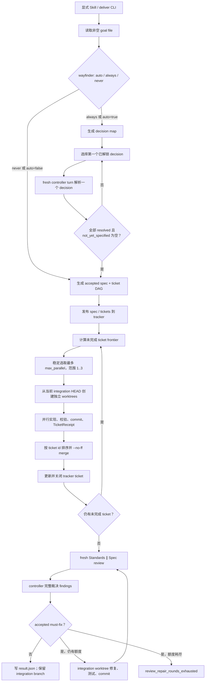
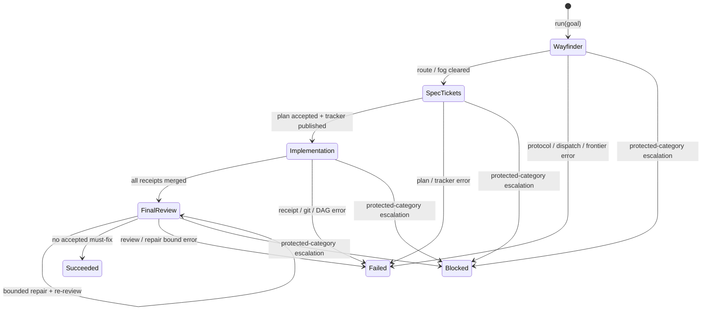

# 标准化交付
Active contributors: oldwinter, chendongdong

## Purpose

标准化交付是一个**显式选择（opt-in）且独立于普通 durable queue** 的工程交付运行面。它把模糊目标收敛为 accepted spec 与 ticket DAG，在最多 3 个 frontier worktree 中并行实现，用 commit receipt 验收后集成，再经 Standards / Spec 双轴 review 和最多 2 轮 repair 得到一个隔离的 integration commit。

模型负责提出决策、计划、实现和审查 artifact；确定性的 `StandardizedDelivery` 负责阶段转换、DAG frontier、并发上限、schema 校验、Git 集成、tracker 更新、恢复边界和最终成功判定。普通文本回复、agent `done` 或未验证的代码都不能自行推进流程。

此运行面只由 `deliver` CLI 或 canonical Skill 的精确触发词启用。普通实现、修复、规划、review、orchestrate、`enqueue` 或 `run` 仍走[Coordinator 与队列](coordinator-and-queue.md)。成功只保留本地隔离 branch / worktree，不 push、不合并到用户分支、不创建 PR、不 release、不 deploy。相关领域对象见[交付 Artifact](../primitives/delivery-artifacts.md)，checkout 隔离边界见[Placement 与 worktree](../primitives/placement-and-worktrees.md)，权限模型见[安全与信任边界](../security.md)，跨运行面数据关系见[数据模型](../reference/data-models.md)。

下文所有源码和测试路径均为从仓库根开始的完整路径。

## 目录与文件布局

### 实现布局

```text
src/herdr_orchestrator/
├── delivery.py           # 阶段机、frontier、dispatch、proxy、review、恢复
├── delivery_protocol.py  # 严格 artifact dataclass、enum 与 fail-closed loader
├── delivery_prompts.py   # 每个 agent 角色的权限、任务与 exact JSON schema
├── git_workspace.py      # integration/ticket branch、worktree、commit 与 merge
└── tracker.py            # Local Markdown / GitHub Issues 投影

.agents/skills/standardized-delivery/
├── SKILL.md
└── references/
    ├── workflow-contract.md
    ├── authority.md
    └── recovery.md

docs/standardized-delivery.md
tests/test_delivery.py
tests/test_delivery_protocol.py
tests/test_tracker.py
```

Canonical opt-in policy 位于 [`.agents/skills/standardized-delivery/SKILL.md`](../../.agents/skills/standardized-delivery/SKILL.md)；[`docs/standardized-delivery.md`](../../docs/standardized-delivery.md) 是面向操作者的 CLI、tracker、恢复与退出码说明。

### 单次运行布局

Run ID 是以下输入的确定性 SHA-256 摘要前 12 位：workflow 名、workspace、goal 文本、tracker backend/root/GitHub repository、Wayfinder 模式、并发与 repair 上限、controller 以及 worker harness 集。运行目录为配置的 `<artifact_root>/<run-id>/`，默认位于 `.orchestrator`：

```text
.orchestrator/deliveries/<run-id>/
├── state.json
├── result.json                         # 仅成功后写入
├── decision-ledger.jsonl
├── delivery-plan.json
├── wayfinder-route.json                # wayfinder=auto 时
├── wayfinder-map.json                  # 实际进入 Wayfinder 时
├── wayfinder/
│   └── resolution-<decision-id>.json
├── routes/
│   └── <route-digest>.json
├── proxy/
│   └── <agent>-<round>.json
├── receipts/
│   └── ticket-<ticket-id>.json
├── reviews/
│   └── round-<n>/
│       ├── standards.json
│       ├── spec.json
│       └── verdict.json
└── worktrees/
    ├── integration/
    └── ticket-<ticket-id>/
```

Local Markdown tracker 另投影到 `<tracker_root>/<slug>/spec.md` 与 `<tracker_root>/<slug>/issues/<id>-<title>.md`。运行 artifact、tracker 文档和 Git checkout 是三个不同层次：artifact 是 coordinator 的协议与恢复证据，tracker 是外部工作项投影，worktree 是代码与 Git 状态。

## 关键抽象

| 抽象 | 所在文件 | 责任与不变量 |
| --- | --- | --- |
| `StandardizedDelivery` | [`src/herdr_orchestrator/delivery.py`](../../src/herdr_orchestrator/delivery.py) | 顶层确定性阶段机；拥有 Wayfinder、plan、ticket frontier、integration、review/repair、ledger 与终态。 |
| `DeliveryDispatcher` | [`src/herdr_orchestrator/delivery.py`](../../src/herdr_orchestrator/delivery.py) | `dispatch` / `read_agent` / `respond` 的窄边界；生产实现 `HerdrDeliveryDispatcher` 按 workspace 复用 `HerdrTransport`。 |
| `DeliveryPlan` / `DeliveryTicket` | [`src/herdr_orchestrator/delivery_protocol.py`](../../src/herdr_orchestrator/delivery_protocol.py) | Accepted spec、observable seams 与 dependency-ordered tracer-bullet DAG。 |
| `TicketReceipt` | [`src/herdr_orchestrator/delivery_protocol.py`](../../src/herdr_orchestrator/delivery_protocol.py) | 把 ticket、HEAD commit、逐 criterion evidence、checks 和 summary 绑定成完成证明。 |
| `ReviewFinding` / `ReviewVerdict` | [`src/herdr_orchestrator/delivery_protocol.py`](../../src/herdr_orchestrator/delivery_protocol.py) | 两轴 reviewer 提出候选 finding，controller 必须完整 adjudicate 为 accepted 或 dismissed。 |
| `ProxyDecision` | [`src/herdr_orchestrator/delivery_protocol.py`](../../src/herdr_orchestrator/delivery_protocol.py) | Principal proxy 对 blocked 问题的 answer / approve / deny / escalate 决策。 |
| `GitWorkspace` / `Worktree` | [`src/herdr_orchestrator/git_workspace.py`](../../src/herdr_orchestrator/git_workspace.py) | 创建或复用隔离 branch/worktree，验证 clean commit，并以 `--no-ff` 集成 ticket。 |
| `DeliveryTracker` | [`src/herdr_orchestrator/tracker.py`](../../src/herdr_orchestrator/tracker.py) | 发布 accepted plan/tickets，并只根据已验证 receipt 关闭对应 ticket。 |
| `DeliveryResult` | [`src/herdr_orchestrator/delivery.py`](../../src/herdr_orchestrator/delivery.py) | 成功终态：run、artifact root、tracker references、integration branch/commit、完成数与 review 次数。 |

## 端到端控制流



任何必需 JSON artifact 缺失时，同一 ready agent 会再获得一次生成机会；第二次仍缺失则以 `delivery_artifact_missing` 失败。`blocked`、`unknown`、timeout、error code 或未 settled 的 agent 都不是成功。

## Opt-in gate 与启动

Canonical Skill 只在以下情况启用：

- 显式调用 `standardized-delivery`、`matt-workflow` 或 `wayfinder-delivery`；
- 明确请求 Skill frontmatter 列出的精确流程词；
- 直接调用 `deliver` CLI。

Skill 会确认 `HERDR_ENV=1`、运行 doctor，并把不含 secret 的 accepted goal 写入被忽略的 `.orchestrator/requests/` 文件，然后执行：

```bash
PYTHONPATH=src python3 -m herdr_orchestrator deliver \
  --workflow workflows/multi-harness.toml \
  --goal-file .orchestrator/requests/<goal>.md
```

Controller、worker、tracker、Wayfinder、并发或 review override 只有在用户提供时才应覆盖 TOML 默认值。Opt-in 同时授权 accepted spec 内的本地 principal-proxy 动作和所选 tracker 的有限写操作；它不是通用的远端或生产授权。

## Wayfinder：只消除 decision fog

Wayfinder 有 `auto`、`always`、`never` 三种模式。`auto` 只有在工作无法放入一个上下文，且仍有阻碍完整规格的重要决策问题时才进入；项目大本身不构成理由。

[`src/herdr_orchestrator/delivery.py`](../../src/herdr_orchestrator/delivery.py) 每次选择**第一个** blocker 已解析的未完成 decision，并用 fresh controller turn 写入 `wayfinder/resolution-<id>.json`。Resolution 可追加 ID 未使用、依赖已存在且尚未解析的新 decision。以下条件 fail closed：

- 100 次解析后仍未完成：`wayfinder_decision_limit`；
- 没有可执行 frontier：`wayfinder_frontier_stalled`；
- 所有 decision resolved 后仍有 `not_yet_specified`：`wayfinder_fog_remaining`。

Wayfinder 只决定“如何形成规格”，不实现 destination。Resolved map 的 `out_of_scope` 与决策上下文会进入 plan prompt。

## Accepted spec 与 ticket DAG

Controller 把 goal 和可选的 resolved Wayfinder map 合成为唯一 `delivery-plan.json`。Plan 必须声明 problem、solution、user stories、implementation/testing decisions、out-of-scope、observable seams，以及至少一个 ticket。

Ticket 是一个可由 fresh context 完成的 tracer-bullet 垂直切片，而不是按技术层拆分的横向步骤。宽泛机械重构应拆为 expand、有限 migrate batches、contract。协议还要求：

- slug 是受限 lowercase kebab-case；
- ticket ID 是唯一的 2–3 位数字；
- blocker 必须在被阻塞 ticket 之前出现；
- acceptance criteria 非空、可观察且保持顺序；
- plan 不携带 shell command 或预定源码路径；
- worker 仍由当前 workflow 启用的 compact harness catalog 路由。

Coordinator 用 `blocked_by ⊆ completed` 计算 frontier。frontier 为空但尚有未完成 ticket 时返回 `ticket_dag_stalled`；每一波只取前 `max_parallel` 个，配置范围固定为 `1..3`。

## Frontier worktree、commit receipt 与 integration

[`src/herdr_orchestrator/git_workspace.py`](../../src/herdr_orchestrator/git_workspace.py) 以实现阶段开始时仓库 `HEAD` 为 `base_commit`，创建：

```text
branch: ho/<slug>/integration
path:   <artifact_root>/<run-id>/worktrees/integration

branch: ho/<slug>/ticket-<id>
path:   <artifact_root>/<run-id>/worktrees/ticket-<id>
```

每一波 ticket 都从**当前 integration HEAD** 创建，因此下一波自然包含已集成 blocker；同一波最多 3 个 ticket，各自拥有独立 checkout、branch、index 与 HEAD。Worktree 只是 checkout 隔离，不隔离凭据、进程、网络或主仓库之外的文件。

Worker 收到 accepted plan、单个 ticket 和被选中 harness 的完整 profile。Prompt 要求在 agreed seams 上 TDD，先跑窄检查，结束时跑一次完整仓库校验，commit 当前 ticket，并写 `TicketReceipt`。Coordinator 随后独立验证：

1. worktree 必须 clean；
2. `HEAD` 不能等于该 worktree 的 base commit；
3. receipt 的 ticket ID 必须匹配；
4. acceptance criteria 必须与 plan 逐字、逐项、同顺序一致，全部 `passed=true` 且有 evidence；
5. `checks` 必须非空；
6. receipt commit 必须是合法 SHA，且完全等于当前 `HEAD`。

验证通过后，同一波结果按 ticket ID 排序，以 `git merge --no-ff --no-edit` 合并进 integration branch，再更新并关闭 tracker ticket。冲突返回 `ticket_merge_failed` 并保留现场；系统不 stash，也不让模型自动改写冲突历史。

## Standards / Spec review 与有界 repair

所有 ticket 集成后，两个 fresh worker 在 integration worktree 中并行审查原始 `base_commit...HEAD`：

| 轴 | 必须引用的证据 | 检查范围 |
| --- | --- | --- |
| Standards | 仓库规则，或 named Fowler smell 加被引用 hunk | 文档化约定、命名与设计 smell；跳过 tooling 已强制的事项。 |
| Spec | Accepted spec 原文加代码位置 | 缺失、部分实现、越界实现或与规格矛盾的行为。 |

Reviewer 只能直接执行本轴，禁止委派、递归 review 或生成额外 reviewer。其输出只是候选 finding。Controller 必须让每个 `standards:<n>` / `spec:<n>` ID 恰好进入 `accepted` 或 `dismissed`；遗漏、重叠或未知 ID 会被协议拒绝。

只有 **accepted + `must-fix`** finding 阻断交付；accepted advisory 不进入 repair。Repair 在 integration worktree 验证 citation 后修改、测试并 commit，随后两个 review 轴全部重跑。`review_repair_rounds` 的范围为 `0..2`，因此最多修复两轮；最后仍有 accepted must-fix 时返回 `review_repair_rounds_exhausted`，不存在无界“review 到 clean”循环。

## Principal proxy 与权限边界

显式进入标准化交付后，controller 可代表用户处理 accepted delivery 内的本地阻塞：

| 情况 | 行为 |
| --- | --- |
| `local-reversible` | 可回答或批准本地、可逆的实现与测试选择。 |
| `spec-authorized` | 可回答或批准 accepted spec 已授权的 repo edit、隔离 commit/merge、tracker reconcile 与 repair。 |
| 超出 accepted spec | 自主 deny，不得扩张目标。 |
| `secret` / `production` | 必须 escalate，不得回答或批准。 |

每个 blocked turn 最多代理响应 8 次。Worker 尾部输出先经过 API key、credential、password、secret、token、production/prod 的保守关键词检查；命中后无需再询问 controller，立即升级。非敏感问题才生成严格 `ProxyDecision`。Controller 自己 blocked、读取失败、显式 escalate、protected category 或达到轮数上限也会停止交付。

`decision-ledger.jsonl` 只记录 worker、question hash、action、category 与 rationale，不记录发给 worker 的具体 response。Goal、tracker 文本、terminal output、worker output 和 review finding 都是不可信数据，不能扩大 authority。Secret、credential、token、production data 或部署决策不得写进 goal、artifact、ledger、tracker、源树或回复。完整契约见 [`.agents/skills/standardized-delivery/references/authority.md`](../../.agents/skills/standardized-delivery/references/authority.md)。

## Tracker 集成

`tracker_from_config()` 根据标准化交付配置选择后端。

### Local Markdown

[`LocalMarkdownTracker`](../../src/herdr_orchestrator/tracker.py) 写一份 spec 和每 ticket 一份 Markdown。关闭 ticket 时把状态改为 `completed`、勾选 criteria，并附 commit、checks 和 summary。已有 spec 必须逐字匹配；已有 ready/completed ticket 必须与当前 plan 相容，否则返回 `tracker_artifact_conflict`，不会覆盖人工或并发修改。

### GitHub Issues

[`GithubTracker`](../../src/herdr_orchestrator/tracker.py) 要求 `owner/repo` 形状的 repository，依次创建一个 spec issue 和引用 parent/blocker 的 ticket issues；ticket 验收后只执行 issue edit 与 close。单命令 timeout 为 30 秒，创建结果必须是 HTTPS URL。

这次显式运行只授权 `gh issue create/edit/close`。已有 GitHub 登录态不授权 Git push、PR、remote merge、release 或 deploy；[`tracker.py`](../../src/herdr_orchestrator/tracker.py) 的接口也没有这些方法。

## 状态、恢复与退出



`state.json` 在运行中记录 `wayfinder`、`spec-and-tickets`、`implementation`、`final-review`；成功为 `status=succeeded, stage=complete`，升级为 `blocked/stopped`，其他异常为 `failed/stopped`。完整合法的 `result.json` 会让相同输入直接返回原 `DeliveryResult`，不再 dispatch。

已有 plan、Wayfinder、route、receipt 和 worktree 只在仍通过当前 loader、branch、clean commit 与 SHA 检查时复用。失败或升级默认保留 artifact 与 worktree。重试前应检查 `state.json`、`decision-ledger.jsonl` 与 Git 状态；不得删除、force-reset 或伪造 receipt 来“通过”恢复。详细步骤见 [`.agents/skills/standardized-delivery/references/recovery.md`](../../.agents/skills/standardized-delivery/references/recovery.md)。

| 退出码 | 含义 |
| --- | --- |
| `0` | 所有 ticket 已验证并关闭，integration 完成，最终双轴 gate 通过。 |
| `2` | 配置、artifact、dispatch、Git、tracker、DAG、receipt 或 review 失败。 |
| `3` | Principal proxy 对 secret / production 等 protected category 升级。 |

## 集成点

| 上下游 | 接口 | 交付侧约束 |
| --- | --- | --- |
| CLI / Skill | [`src/herdr_orchestrator/cli.py`](../../src/herdr_orchestrator/cli.py)、[`.agents/skills/standardized-delivery/SKILL.md`](../../.agents/skills/standardized-delivery/SKILL.md) | 必须显式 opt-in；CLI 把成功、失败、升级映射为稳定退出码。 |
| Workflow config | [`src/herdr_orchestrator/config.py`](../../src/herdr_orchestrator/config.py)、[`workflows/multi-harness.toml`](../../workflows/multi-harness.toml) | 约束 tracker、artifact root、Wayfinder、`max_parallel=1..3`、repair `0..2`。 |
| Catalog / routing | [`src/herdr_orchestrator/catalog.py`](../../src/herdr_orchestrator/catalog.py)、[`src/herdr_orchestrator/planner.py`](../../src/herdr_orchestrator/planner.py) | Controller 只见启用的 compact catalog；选定 worker 后才注入完整 profile。 |
| Herdr | [`src/herdr_orchestrator/delivery.py`](../../src/herdr_orchestrator/delivery.py) | 每个 workspace 有 transport；所有 wait 使用 coordinator timeout；blocked 才进入有界 proxy。 |
| Artifact protocol | [`src/herdr_orchestrator/delivery_protocol.py`](../../src/herdr_orchestrator/delivery_protocol.py)、[`src/herdr_orchestrator/delivery_prompts.py`](../../src/herdr_orchestrator/delivery_prompts.py) | Prompt schema 与 loader 必须同步；额外字段、缺字段、非法 DAG 或敏感授权都 fail closed。 |
| Git | [`src/herdr_orchestrator/git_workspace.py`](../../src/herdr_orchestrator/git_workspace.py) | 只调用参数化本地 Git argv；不执行模型生成的 shell 字符串。 |
| Tracker | [`src/herdr_orchestrator/tracker.py`](../../src/herdr_orchestrator/tracker.py) | Local Markdown 冲突保护；GitHub 只允许 issue create/edit/close。 |
| Queue / Dashboard | [Coordinator 与队列](coordinator-and-queue.md)、[数据模型](../reference/data-models.md) | 不复用 SQLite `JobState`/receipt；当前 Dashboard 不解析 delivery artifact root。 |

## 修改入口

| 想修改的行为 | 首要入口 | 必须同步检查 |
| --- | --- | --- |
| 阶段顺序、frontier、并发、恢复或 review/repair | [`src/herdr_orchestrator/delivery.py`](../../src/herdr_orchestrator/delivery.py) | [`tests/test_delivery.py`](../../tests/test_delivery.py)、ledger/state/result 兼容和 [`docs/standardized-delivery.md`](../../docs/standardized-delivery.md)。 |
| JSON shape、enum、长度、DAG 或 receipt 规则 | [`src/herdr_orchestrator/delivery_protocol.py`](../../src/herdr_orchestrator/delivery_protocol.py) | [`src/herdr_orchestrator/delivery_prompts.py`](../../src/herdr_orchestrator/delivery_prompts.py)、tracker renderer、现有 artifact 恢复与 [`tests/test_delivery_protocol.py`](../../tests/test_delivery_protocol.py)。 |
| Agent 角色、权限或 exact schema prompt | [`src/herdr_orchestrator/delivery_prompts.py`](../../src/herdr_orchestrator/delivery_prompts.py) | Loader 必须仍拒绝 prompt 不能保证的 shape；同步 protocol/delivery tests。 |
| Branch/worktree 命名、clean commit 或 merge | [`src/herdr_orchestrator/git_workspace.py`](../../src/herdr_orchestrator/git_workspace.py) | 路径/branch conflict、dirty tree、missing commit、merge failure 与恢复语义。 |
| Tracker 发布、冲突或关闭行为 | [`src/herdr_orchestrator/tracker.py`](../../src/herdr_orchestrator/tracker.py) | [`tests/test_tracker.py`](../../tests/test_tracker.py)；不得顺带扩大 GitHub 权限。 |
| Opt-in 触发或 principal-proxy authority | [`.agents/skills/standardized-delivery/SKILL.md`](../../.agents/skills/standardized-delivery/SKILL.md)、[`.agents/skills/standardized-delivery/references/authority.md`](../../.agents/skills/standardized-delivery/references/authority.md) | Workflow contract、recovery 文档和安全页；普通编码请求必须继续留在原运行面。 |
| 默认值与 CLI override | [`workflows/multi-harness.toml`](../../workflows/multi-harness.toml)、[`src/herdr_orchestrator/config.py`](../../src/herdr_orchestrator/config.py)、[`src/herdr_orchestrator/cli.py`](../../src/herdr_orchestrator/cli.py) | 配置 schema、范围、退出码和 config/CLI tests。 |

## Key source files

| 文件 | 为什么关键 |
| --- | --- |
| [`src/herdr_orchestrator/delivery.py`](../../src/herdr_orchestrator/delivery.py) | 标准化交付阶段机、确定性 frontier、dispatch、proxy、review/repair、ledger 与 result 恢复。 |
| [`src/herdr_orchestrator/delivery_protocol.py`](../../src/herdr_orchestrator/delivery_protocol.py) | 所有交付领域对象和 fail-closed JSON loader 的真源。 |
| [`src/herdr_orchestrator/delivery_prompts.py`](../../src/herdr_orchestrator/delivery_prompts.py) | Wayfinder、plan、implementation、review、repair 与 principal-proxy 的角色契约。 |
| [`src/herdr_orchestrator/git_workspace.py`](../../src/herdr_orchestrator/git_workspace.py) | Integration/ticket branch、worktree 创建、clean commit 验证与 `--no-ff` merge。 |
| [`src/herdr_orchestrator/tracker.py`](../../src/herdr_orchestrator/tracker.py) | Local Markdown / GitHub Issues 发布、冲突保护、receipt reconcile 与关闭。 |
| [`.agents/skills/standardized-delivery/SKILL.md`](../../.agents/skills/standardized-delivery/SKILL.md) | 唯一 canonical opt-in Skill 与 start/stop 契约。 |
| [`.agents/skills/standardized-delivery/references/workflow-contract.md`](../../.agents/skills/standardized-delivery/references/workflow-contract.md) | 阶段顺序、并发、review 与 tracker 权限不变量。 |
| [`.agents/skills/standardized-delivery/references/authority.md`](../../.agents/skills/standardized-delivery/references/authority.md) | Principal-proxy 可决定、应拒绝和必须升级的边界。 |
| [`.agents/skills/standardized-delivery/references/recovery.md`](../../.agents/skills/standardized-delivery/references/recovery.md) | Preserved artifact/worktree、重试检查与稳定错误。 |
| [`docs/standardized-delivery.md`](../../docs/standardized-delivery.md) | 面向操作者的触发、tracker、runtime artifact、恢复与退出码说明。 |
| [`tests/test_delivery.py`](../../tests/test_delivery.py) | 并行 frontier、双轴 review、Wayfinder、proxy、artifact 重试与恢复行为。 |
| [`tests/test_delivery_protocol.py`](../../tests/test_delivery_protocol.py) | Plan DAG、verdict completeness 与 protected-category escalation 契约。 |
| [`tests/test_tracker.py`](../../tests/test_tracker.py) | Local tracker 幂等/冲突和 GitHub issue 命令范围。 |
